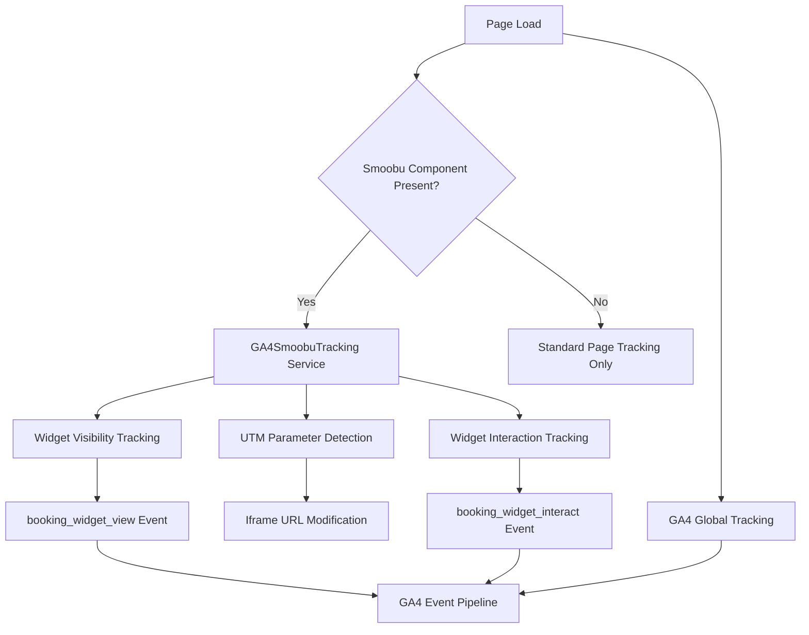

# Design Document

## Overview

The GA4 + Smoobu tracking system enhances the existing Google Analytics 4 implementation by adding UTM parameter pass-through and widget interaction tracking specifically for Smoobu booking iframes. The system maintains the current global GA4 setup while adding targeted tracking capabilities for booking funnel analysis.

## Architecture

### Current State Analysis

The application already has:
- **Global GA4 Implementation**: Configured in `public/index.html` with measurement ID G-Q1LMHMNCMW
- **Smoobu Component**: Located at `src/components/Smoobu/Smoobu.component.tsx` that dynamically loads Smoobu iframes
- **Service Pattern**: Established pattern with `MetaPixel.service.ts` and `CookieConsent.service.ts`

### System Components



## Components and Interfaces

### 1. GA4SmoobuTracking Service

**Location**: `src/services/GA4SmoobuTracking.service.ts`

**Purpose**: Centralized service for managing GA4 tracking enhancements for Smoobu iframes.

**Interface**:
```typescript
interface GA4SmoobuTrackingConfig {
  enabled: boolean;
  debug: boolean;
  visibilityThreshold: number; // milliseconds (default: 3000)
}

interface GA4SmoobuTrackingService {
  initialize(config: GA4SmoobuTrackingConfig): void;
  trackPageWithSmoobu(iframeElement: HTMLIFrameElement): void;
  cleanup(): void;
  getState(): GA4TrackingState;
}

interface GA4TrackingState {
  isInitialized: boolean;
  trackedIframes: Set<HTMLIFrameElement>;
  eventsTracked: {
    viewEvents: number;
    interactionEvents: number;
  };
}
```

### 2. UTM Parameter Manager

**Purpose**: Handles detection and pass-through of UTM and Google Ads parameters.

**Interface**:
```typescript
interface UTMParameterManager {
  detectParameters(): URLSearchParams;
  appendToIframeUrl(iframe: HTMLIFrameElement, parameters: URLSearchParams): void;
  getSupportedParameters(): string[];
}
```

### 3. Widget Visibility Tracker

**Purpose**: Monitors iframe visibility and fires GA4 events.

**Interface**:
```typescript
interface WidgetVisibilityTracker {
  startTracking(iframe: HTMLIFrameElement): void;
  stopTracking(iframe: HTMLIFrameElement): void;
  isVisible(element: HTMLElement): boolean;
}
```

### 4. Widget Interaction Tracker

**Purpose**: Detects user interactions with Smoobu iframes.

**Interface**:
```typescript
interface WidgetInteractionTracker {
  attachListeners(iframe: HTMLIFrameElement): void;
  removeListeners(iframe: HTMLIFrameElement): void;
  trackInteraction(eventType: string): void;
}
```

## Data Models

### UTM Parameters Model
```typescript
type UTMParameter = 
  | 'utm_source' 
  | 'utm_medium' 
  | 'utm_campaign' 
  | 'utm_content' 
  | 'utm_term';

type GoogleAdsParameter = 
  | 'gclid' 
  | 'gbraid' 
  | 'wbraid';

type TrackingParameter = UTMParameter | GoogleAdsParameter;
```

### GA4 Event Models
```typescript
interface GA4WidgetEvent {
  event_name: 'booking_widget_view' | 'booking_widget_interact';
  event_category: 'booking';
  custom_parameters?: Record<string, any>;
}
```

## Implementation Strategy

### Phase 1: Service Foundation
1. Create `GA4SmoobuTracking.service.ts` with core interfaces
2. Implement UTM parameter detection and URL modification logic
3. Add basic iframe detection capabilities

### Phase 2: Event Tracking
1. Implement visibility tracking with intersection observer
2. Add interaction event listeners (mouseenter, focus)
3. Integrate with existing gtag function

### Phase 3: Smoobu Component Integration
1. Modify `Smoobu.component.tsx` to initialize tracking service
2. Add tracking activation after iframe loads
3. Ensure cleanup on component unmount

### Phase 4: Testing and Validation
1. Add development mode debugging
2. Implement GA4 DebugView validation helpers
3. Create manual testing utilities

## Integration Points

### 1. Smoobu Component Enhancement

The existing `Smoobu.component.tsx` will be enhanced to:
- Initialize GA4 tracking service after iframe loads
- Pass iframe reference to tracking service
- Handle cleanup on component unmount

**Key Integration Points**:
```typescript
// After iframe initialization in useEffect
if (window.gtag && iframe) {
  GA4SmoobuTrackingService.trackPageWithSmoobu(iframe);
}

// In cleanup
useEffect(() => {
  return () => {
    GA4SmoobuTrackingService.cleanup();
  };
}, []);
```

### 2. Global GA4 Integration

The service will integrate with the existing GA4 setup by:
- Using the existing `window.gtag` function
- Respecting the current measurement ID (G-Q1LMHMNCMW)
- Following the established event naming conventions

### 3. Environment Configuration

New environment variables for configuration:
```
REACT_APP_GA4_SMOOBU_TRACKING_ENABLED=true
REACT_APP_GA4_SMOOBU_TRACKING_DEBUG=false
REACT_APP_GA4_SMOOBU_VISIBILITY_THRESHOLD=3000
```

## Error Handling

### 1. Graceful Degradation
- Service fails silently if GA4 is not available
- UTM pass-through continues even if event tracking fails
- No impact on existing Smoobu functionality

### 2. Error Scenarios
- **Missing gtag function**: Log warning, skip event tracking
- **Iframe not found**: Skip tracking initialization
- **Parameter parsing errors**: Continue with available parameters
- **Event tracking failures**: Log error, continue operation

### 3. Debug Mode
When debug mode is enabled:
- Console logging for all tracking operations
- Validation of parameter pass-through
- Event firing confirmations
- Performance timing information

## Testing Strategy

### 1. Unit Testing
- UTM parameter detection and URL modification
- Event tracking logic (mocked gtag)
- Visibility detection algorithms
- Service state management

### 2. Integration Testing
- Smoobu component integration
- GA4 event pipeline validation
- Parameter pass-through end-to-end
- Multiple iframe scenarios

### 3. Manual Testing
- GA4 DebugView event verification
- UTM parameter validation in iframe URLs
- Cross-browser compatibility
- Mobile responsiveness

### 4. Development Tools
- Console debugging utilities
- Parameter validation helpers
- Event tracking status indicators
- Performance monitoring

## Performance Considerations

### 1. Lazy Loading
- Service only initializes when Smoobu iframes are present
- Event listeners attached only to relevant iframes
- Cleanup prevents memory leaks

### 2. Throttling
- Visibility checks throttled to 250ms intervals
- Single event firing per page load
- Efficient DOM queries with caching

### 3. Bundle Size
- Minimal additional JavaScript footprint
- No external dependencies
- Tree-shakeable service modules

## Security Considerations

### 1. Parameter Validation
- Whitelist of allowed UTM parameters
- URL validation before iframe modification
- XSS prevention in parameter handling

### 2. Privacy Compliance
- Respects existing cookie consent implementation
- No additional personal data collection
- GDPR-compliant event tracking

## Browser Compatibility

### Supported Browsers
- Chrome 60+
- Firefox 55+
- Safari 12+
- Edge 79+

### Fallback Strategies
- Intersection Observer polyfill for older browsers
- URLSearchParams polyfill if needed
- Graceful degradation for unsupported features