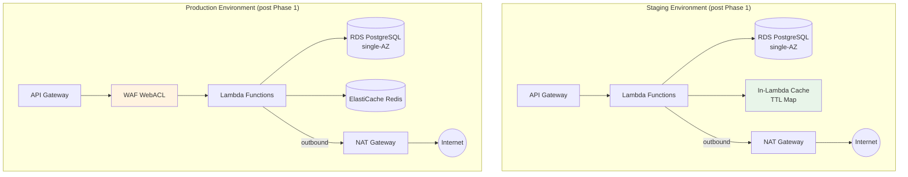
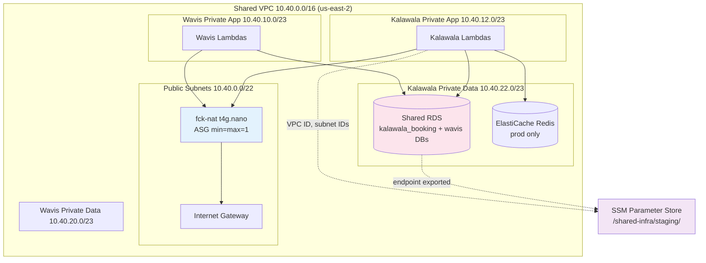

# Design Document: Infrastructure Cost Optimization

## Overview

This design covers the two-phase cost optimization of the Kalawala booking engine's AWS infrastructure, reducing monthly spend from ~$320 to ~$90. The approach uses Terraform conditional resource creation (via boolean/string variables and `count` meta-arguments) for Phase 1 quick wins, and introduces a region migration with shared VPC architecture in Phase 2.

**Phase 1** modifies existing Terraform configurations to make expensive resources conditional (ElastiCache, WAF) and disables unnecessary redundancy (Multi-AZ, dev environment). A new in-Lambda memory cache module replaces ElastiCache in environments where Redis is disabled.

**Phase 2** replaces the managed NAT Gateway with fck-nat (~$3/month vs ~$32/month), migrates from us-east-1 to us-east-2 to co-locate with the Wavis project, restructures the VPC for multi-project sharing, and enables a shared RDS instance in staging.

### Design Decisions & Rationale

| Decision | Rationale |
|----------|-----------|
| `count` meta-argument for conditionals | Simpler than `for_each` for boolean toggles; well-understood pattern |
| fck-nat via ASG (min/max/desired=1) | Auto-recovery without CloudWatch alarms; EIP re-association on replacement |
| SSM Parameter Store for cross-project state | Avoids tight coupling via `terraform_remote_state`; Wavis reads outputs without access to Kalawala's state bucket |
| In-Lambda cache as module-level Map | Survives warm starts; zero external dependencies; bounded by LRU eviction at 1000 entries |
| Destroy-and-recreate for region migration | AWS resources cannot move between regions; clean state avoids drift |
| Shared RDS with `null_resource` psql | Terraform cannot manage individual PostgreSQL databases/roles natively; `local-exec` with psql is the standard workaround |

## Architecture

### Phase 1 Architecture (Quick Wins)



### Phase 2 Architecture (Shared VPC in us-east-2)



## Components and Interfaces

### 1. Terraform Variable Layer (Phase 1 & 2)

New variables added to `infra/variables.tf`:

| Variable | Type | Default | New/Modified | Purpose |
|----------|------|---------|--------------|---------|
| `elasticache_enabled` | `bool` | `true` | New | Toggle ElastiCache provisioning |
| `waf_enabled` | `bool` | `true` | New | Toggle WAF WebACL provisioning |
| `nat_gateway_type` | `string` | `"managed"` | New | Switch between managed NAT and fck-nat |
| `shared_rds_enabled` | `bool` | `false` | New | Enable shared RDS with Wavis database |
| `db_multi_az` | `bool` | `false` | Modified (default changed from `false`, prod override removed) | Disable Multi-AZ standby replica |

### 2. Conditional Resource Blocks (Phase 1)

**ElastiCache (`cache.tf`)**: All resources wrapped with `count = var.elasticache_enabled ? 1 : 0`. Security group, subnet group, parameter group, replication group, secrets, and CloudWatch log groups all gated.

**WAF (`waf.tf`)**: WebACL and association wrapped with `count = var.waf_enabled ? 1 : 0`. WAF-related CloudWatch log groups use `count = 1` always (decoupled from `waf_enabled`) with their existing retention period (`local.cloudwatch_log_retention_days`), ensuring logs are preserved for audit/security review even after WAF is disabled. The log groups are only destroyed when the entire environment is torn down.

**Lambda environment variables (`lambda.tf`)**: Conditional merge — when `elasticache_enabled = false`, omit `REDIS_HOST`/`REDIS_PORT`/`REDIS_SECRET_NAME` and set `CACHE_BACKEND=memory`.

### 3. In-Lambda Cache Module (Phase 1 — Requirement 4)

A TypeScript module at `booking-api/src/memoryCache.ts` implementing a bounded LRU TTL map.

```typescript
interface CacheAdapter {
  get(key: string): Promise<string | null>;
  set(key: string, value: string, ttlSeconds: number): Promise<void>;
  del(key: string): Promise<void>;
  invalidateByPrefix(prefix: string): Promise<number>;
}
```

**Internal structure**: A `Map<string, { value: string; expiresAtMs: number }>` with LRU tracking via insertion order (Map preserves insertion order; on access, delete + re-insert to move to end). Eviction on `set()` when size exceeds 1000 entries — removes the oldest (least-recently-used) entry.

**TTL scopes**:
- `availability`: 30 seconds
- `calendar-rates`: 300 seconds (5 minutes)

**Factory pattern**: `createCacheAdapter(backend: 'redis' | 'memory', redisConfig?: RedisConfig): CacheAdapter` — returns either the Redis adapter or the memory adapter based on the `CACHE_BACKEND` environment variable.

### 4. fck-nat Module (Phase 2 — Requirement 6)

Replaces the managed NAT Gateway when `nat_gateway_type = "fck-nat"`:

- **AMI resolution**: `aws_ami` data source filtered by name pattern `fck-nat-al2023-*`, architecture `arm64`, owner `568608671756`
- **Instance**: `t4g.nano` in first public subnet, source/dest check disabled
- **Networking**: Security group allows all outbound, inbound only from VPC CIDR
- **High availability**: ASG with `min_size = max_size = desired_capacity = 1` for auto-recovery
- **Stable IP**: EIP allocated by Terraform; fck-nat self-associates on boot via user-data (see below)
- **Route table**: fck-nat self-updates the private route table on boot via user-data (see below)

#### fck-nat User-Data Configuration

The fck-nat AMI reads configuration from instance user-data to handle EIP re-association and route table updates on every boot (including ASG replacements):

```bash
# user-data passed via launch template
#!/bin/bash
# fck-nat configuration — these are read by the fck-nat service on boot
echo "eip_id=${EIP_ALLOCATION_ID}" >> /etc/fck-nat.conf
echo "route_table_id=${PRIVATE_ROUTE_TABLE_ID}" >> /etc/fck-nat.conf
```

On boot, fck-nat:
1. Calls `aws ec2 associate-address --allocation-id $eip_id --instance-id $(curl http://169.254.169.254/latest/meta-data/instance-id)` to claim the EIP
2. Calls `aws ec2 replace-route --route-table-id $route_table_id --destination-cidr-block 0.0.0.0/0 --instance-id $(instance-id)` to point the private route table at itself

Both values are interpolated into the launch template user-data from Terraform variables.

#### fck-nat IAM Instance Profile

The fck-nat instance requires an IAM instance profile with the following permissions:

```json
{
  "Version": "2012-10-17",
  "Statement": [
    {
      "Sid": "FckNatSelfConfigure",
      "Effect": "Allow",
      "Action": [
        "ec2:AssociateAddress",
        "ec2:ReplaceRoute",
        "ec2:ModifyInstanceAttribute"
      ],
      "Resource": "*",
      "Condition": {
        "StringEquals": {
          "aws:ResourceTag/Project": "kalawala"
        }
      }
    }
  ]
}
```

The Terraform configuration creates:
- `aws_iam_role.fck_nat` with EC2 assume-role trust policy
- `aws_iam_instance_profile.fck_nat` attached to the launch template
- `aws_iam_role_policy.fck_nat_self_configure` with the above permissions

#### fck-nat Route Table Behavior

The initial `aws_route` in Terraform points the private route table at the fck-nat instance. On ASG replacement:
1. Old instance terminates → route becomes a blackhole briefly
2. New instance boots → fck-nat user-data runs `replace-route` → route restored
3. Typical recovery time: 30–60 seconds (instance boot + user-data execution)

This is acceptable for a low-traffic booking engine where brief NAT outages cause retryable failures (Lambda retries on timeout).

### 5. Shared VPC Module (Phase 2 — Requirement 8)

Restructured subnet layout with project-scoped CIDR allocations:

| Subnet | CIDR | Project Tag |
|--------|------|-------------|
| Public (shared) | `10.40.0.0/22` | `shared` |
| Kalawala app | `10.40.12.0/23` | `kalawala` |
| Kalawala data | `10.40.22.0/23` | `kalawala` |
| Wavis app | `10.40.10.0/23` | `wavis` |
| Wavis data | `10.40.20.0/23` | `wavis` |

**Lifecycle protection**: The VPC resource includes `lifecycle { prevent_destroy = true }` to prevent accidental destruction of the shared network when either project runs `terraform destroy`. Removing this guard requires a deliberate code change and review.

**SSM exports** under `/shared-infra/{environment}/`:
- `vpc-id`
- `public-subnet-ids` (comma-separated)
- `private-route-table-id`
- `nat-eip`
- `rds/endpoint` (when shared_rds_enabled)
- `rds/port`

Wavis' Terraform reads these via `aws_ssm_parameter` data sources — no direct dependency on Kalawala's state file. This means Kalawala can plan/apply independently without affecting Wavis, and vice versa.

### 6. Shared RDS (Phase 2 — Requirement 9)

When `shared_rds_enabled = true`:
- Single `db.t4g.small` PostgreSQL 16 instance
- Initial database: `kalawala_booking`
- `null_resource` with `local-exec` runs psql to:
  1. `CREATE DATABASE wavis;`
  2. `CREATE USER wavis_user WITH PASSWORD '...';`
  3. `GRANT ALL ON DATABASE wavis TO wavis_user;`
  4. `REVOKE CREATE ON SCHEMA public FROM wavis_user;` (in kalawala_booking)
- Separate Secrets Manager entries for each project
- Security group allows ingress from both Kalawala (`10.40.12.0/23`) and Wavis (`10.40.10.0/23`) app subnets

#### psql Connectivity for local-exec

The RDS instance is in private subnets with no public access. The `null_resource` local-exec step requires network connectivity to the database. The mechanism:

**SSM Session Manager port forwarding** — the operator (or CI runner) establishes a tunnel before Terraform runs the provisioner:

```bash
# Establish tunnel (runs in background before terraform apply)
aws ssm start-session \
  --target <fck-nat-instance-id> \
  --document-name AWS-StartPortForwardingSessionToRemoteHost \
  --parameters '{"host":["<rds-endpoint>"],"portNumber":["5432"],"localPortNumber":["15432"]}'
```

The `null_resource` local-exec then connects to `localhost:15432`. The fck-nat instance doubles as the SSM bastion since it's already in the VPC with the SSM agent installed (fck-nat AMI includes it).

**Alternative for CI/CD**: Run Terraform from a CodeBuild project configured with VPC access to the private subnets. This eliminates the need for port forwarding but adds CodeBuild cost (~$0.005/build-minute).

The design uses SSM port forwarding as the primary mechanism since it's zero-cost and the fck-nat instance is already present.

#### Decoupling Guard (AC 9.9)

When `shared_rds_enabled` is changed from `true` to `false`, the RDS instance must not be destroyed if Wavis data exists. This is enforced via:

```hcl
resource "aws_db_instance" "main" {
  # ...existing config...

  lifecycle {
    # prevent_destroy must be a literal — variables not allowed here.
    # Static true ensures the shared RDS cannot be accidentally destroyed.
    # To decommission: operator must `terraform state rm` after manual migration.
    prevent_destroy = true

    precondition {
      condition     = !var.shared_rds_enabled || can(data.aws_ssm_parameter.wavis_migration_complete.value)
      error_message = "Cannot disable shared RDS until Wavis data migration is complete. Set /shared-infra/{env}/rds/wavis-migration-complete to 'true' after migrating."
    }
  }
}
```

This provides two layers of protection:
1. `prevent_destroy = true` (static literal) blocks any `terraform destroy` from removing the RDS instance
2. The `precondition` blocks `terraform apply` from proceeding with `shared_rds_enabled = false` until the operator confirms Wavis data migration is complete via the SSM parameter flag

To fully decommission: operator migrates Wavis data → sets SSM flag → runs `terraform state rm aws_db_instance.main` → re-applies with `shared_rds_enabled = false`.

## Data Models

### Terraform State Structure

```
S3 Backend:
├── kalawala/staging/terraform.tfstate   (us-east-2, post-migration)
├── kalawala/prod/terraform.tfstate      (us-east-2, post-migration)
└── kalawala/legacy/                     (us-east-1 states archived)
```

### SSM Parameter Store Schema

```
/shared-infra/{environment}/
├── vpc-id                    → "vpc-0abc123..."
├── public-subnet-ids         → "subnet-aaa,subnet-bbb"
├── private-route-table-id    → "rtb-xyz..."
├── nat-eip                   → "3.14.159.26"
└── rds/
    ├── endpoint              → "kalawala-staging-db.abc.us-east-2.rds.amazonaws.com"
    └── port                  → "5432"
```

### In-Lambda Cache Entry Model

```typescript
interface CacheEntry {
  value: string;          // Serialized cached data
  expiresAtMs: number;    // Unix timestamp in milliseconds
}

// Internal storage: Map<string, CacheEntry>
// Max entries: 1000
// Eviction: LRU (least-recently-used removed on overflow)
```

### Environment tfvars Changes

**staging.tfvars (post Phase 1)**:
```hcl
# Cost estimate: ~$62/month (down from ~$137/month)
elasticache_enabled = false
waf_enabled         = false
```

**prod.tfvars (post Phase 1)**:
```hcl
# Cost estimate: ~$137/month (down from ~$183/month)
db_multi_az = false
```

**staging.tfvars (post Phase 2)**:
```hcl
# Cost estimate: ~$35/month
nat_gateway_type  = "fck-nat"
shared_rds_enabled = true
aws_region        = "us-east-2"
availability_zones = ["us-east-2a", "us-east-2b"]
vpc_cidr          = "10.40.0.0/16"
```

**prod.tfvars (post Phase 2)**:
```hcl
# Cost estimate: ~$55/month
nat_gateway_type = "fck-nat"
aws_region       = "us-east-2"
availability_zones = ["us-east-2a", "us-east-2b"]
```


## Correctness Properties

*A property is a characteristic or behavior that should hold true across all valid executions of a system — essentially, a formal statement about what the system should do. Properties serve as the bridge between human-readable specifications and machine-verifiable correctness guarantees.*

**Note:** The majority of this feature is Infrastructure as Code (Terraform). PBT is NOT appropriate for IaC — Terraform configurations are declarative and tested via `terraform plan` verification, snapshot tests, and integration tests. Property-based testing applies only to Requirement 4 (In-Lambda Cache Module), which is a pure data structure with clear input/output behavior.

### Property 1: Cache TTL round-trip

*For any* key-value pair stored in the In-Lambda Cache with a given TTL, calling `get(key)` before the TTL has elapsed SHALL return the stored value, and calling `get(key)` after the TTL has elapsed SHALL return null (cache miss).

**Validates: Requirements 4.1, 4.2, 4.3**

### Property 2: Size invariant with LRU eviction

*For any* sequence of `set` operations on the In-Lambda Cache, the number of stored entries SHALL never exceed 1000. When a `set` operation would cause the count to exceed 1000, the least-recently-used entry (the entry that was neither written nor read most recently) SHALL be evicted, and all other entries SHALL remain accessible.

**Validates: Requirements 4.7**

### Property 3: Delete and invalidateByPrefix correctness

*For any* set of cached entries and any prefix string, calling `invalidateByPrefix(prefix)` SHALL remove all and only entries whose keys start with that prefix, and the returned count SHALL equal the number of removed entries. Calling `del(key)` SHALL remove that specific entry and subsequent `get(key)` SHALL return null.

**Validates: Requirements 4.3, 4.4 (cache miss on expired/deleted key), 4.8 (interface conformance — invalidateByPrefix is part of the adapter interface)**

## Error Handling

### Terraform Operations

| Scenario | Handling |
|----------|----------|
| `terraform plan` shows unexpected resource destruction | CI pipeline fails with allowlist mismatch; operator reviews before apply |
| fck-nat instance becomes unhealthy | ASG terminates and replaces instance; new instance runs user-data to re-associate EIP and update route table (~30-60s recovery) |
| Shared RDS `null_resource` psql fails | Terraform marks resource as tainted; operator establishes SSM port-forward tunnel and re-runs apply |
| SES verification fails in us-east-2 | Migration blocked; operator must complete verification before DNS cutover |
| Region migration: new environment fails validation | Old environment remains active; no DNS cutover until 24h parallel validation passes |

### In-Lambda Cache

| Scenario | Handling |
|----------|----------|
| Cache entry expired | `get()` returns `null`; caller fetches fresh data from upstream (Smoobu API) |
| Cache at capacity (1000 entries) | LRU entry evicted silently on next `set()`; no error thrown |
| `invalidateByPrefix` with no matches | Returns `0`; no error |
| Unexpected value type in cache | TypeScript enforces `string` values at compile time; runtime treats all values as opaque strings |

### Migration Rollback Plan

1. **Phase 1 rollback**: Set variables back to original values (`elasticache_enabled = true`, `waf_enabled = true`, `db_multi_az = true`) and re-apply. All changes are reversible.
2. **Phase 2 rollback**: DNS remains pointed at us-east-1 until validation passes. If us-east-2 fails, simply continue using us-east-1 (no destruction until validation complete).
3. **fck-nat rollback**: Set `nat_gateway_type = "managed"` and re-apply to restore managed NAT Gateway.

## Testing Strategy

### Infrastructure Testing (Requirements 1-3, 5-11)

PBT is **not applicable** for the Terraform/IaC portions of this feature. Instead:

**Terraform Plan Validation (CI pipeline)**:
- `terraform plan -detailed-exitcode` for each variable change
- Compare planned resource addresses against an allowlist per variable
- Verify no unexpected destroys or modifications

**Plan Safety Allowlist Format** (`infra/plan-allowlists/`):

Each variable change has a corresponding YAML allowlist file:

```yaml
# infra/plan-allowlists/elasticache-disabled.yaml
variable_change: "elasticache_enabled: true -> false"
allowed_actions:
  destroy:
    - "aws_elasticache_replication_group.cache[0]"
    - "aws_elasticache_subnet_group.redis[0]"
    - "aws_elasticache_parameter_group.redis7[0]"
    - "aws_secretsmanager_secret.redis[0]"
    - "aws_secretsmanager_secret_version.redis[0]"
    - "aws_security_group.elasticache[0]"
    - "aws_cloudwatch_log_group.redis_engine[0]"
    - "aws_cloudwatch_log_group.redis_slow[0]"
  update:
    - "aws_lambda_function.booking_api"
    - "aws_lambda_function.webhooks"
    - "aws_lambda_function.hold_expiry"
    - "aws_lambda_function.payment_reconciliation"
```

The CI script:
1. Detects which variables changed (diff of tfvars file)
2. Loads the corresponding allowlist YAML
3. Parses `terraform plan -json` output for resource addresses and actions
4. Fails if any planned resource address + action is not in the allowlist

**Integration Tests (post-apply)**:
- Lambda invocation succeeds (API Gateway returns 200)
- RDS connectivity from Lambda (query returns expected data)
- NAT egress works (Lambda can reach external APIs)
- SES sends test email in new region
- SSM parameters readable by Wavis Terraform

**Smoke Tests**:
- `terraform validate` passes for all tfvars combinations
- `terraform plan` produces no errors for staging and prod configurations
- fck-nat instance health check passes (ASG reports healthy)

### Application Testing (Requirement 4 — In-Lambda Cache)

**Property-Based Tests** (using `fast-check` for TypeScript):
- Minimum 100 iterations per property test
- Each test tagged with: `Feature: infra-cost-optimization, Property {N}: {description}`
- Tests run as part of `booking-api` test suite (`npm test` in `booking-api/`)

**Unit Tests** (specific examples):
- `get` on non-existent key returns `null`
- `set` then `get` with known key/value
- `del` removes specific entry
- `invalidateByPrefix("availability:")` removes only availability keys
- Default TTL scopes: availability = 30s, calendar-rates = 300s
- Interface conformance: all 4 methods exist and return correct types

**Configuration**:
- Property test library: `fast-check` (already available in Node.js ecosystem)
- Minimum iterations: 100 per property
- Tag format: `Feature: infra-cost-optimization, Property 1: Cache TTL round-trip`

### Cost Validation

- Post Phase 1: Verify AWS Cost Explorer shows ~$121/month reduction
- Post Phase 2: Verify total monthly cost is ~$90/month
- Each tfvars file includes a cost estimate comment for documentation
