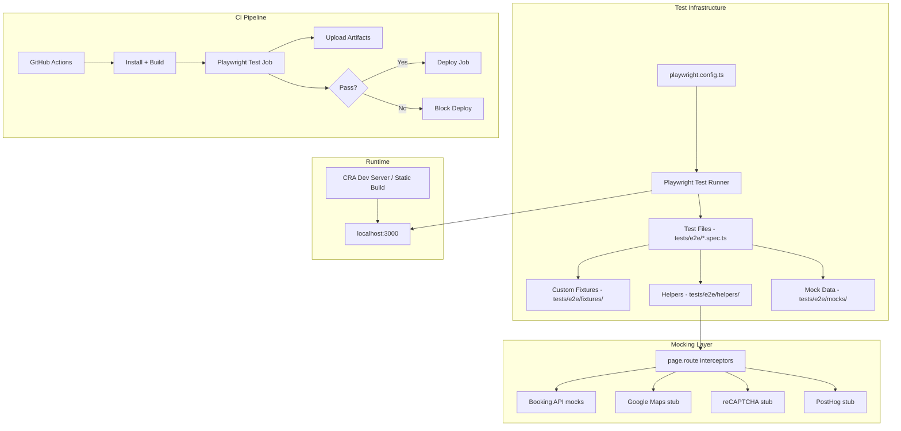
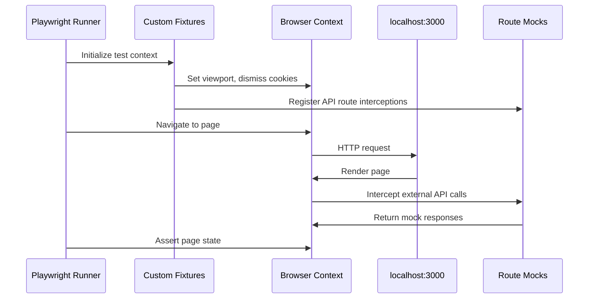

# Design Document: Playwright E2E Testing

## Overview

This design defines the architecture for adding Playwright-based end-to-end testing to kalawala-web. The E2E suite validates critical user journeys — homepage loading, navigation, language switching, booking search, booking flow, property listings, blog pages, guest portal, cookie consent, and responsive behavior — against a local dev server with all external APIs mocked.

The design prioritizes:
- **Accessible selectors** (`getByRole`, `getByLabel`, `getByText`) over brittle CSS selectors
- **Deterministic tests** via comprehensive API mocking (no network calls to production)
- **Fast feedback** via parallel test execution and shared fixtures
- **CI integration** that gates deployment on E2E pass

### Key Design Decisions

| Decision | Rationale |
|----------|-----------|
| Chromium-only in CI, multi-browser locally | Keeps CI fast while allowing cross-browser validation during development |
| Custom fixtures for cookie consent dismissal | Avoids repetitive setup in every test file |
| Centralized API mock helper | Single source of truth for mock responses; per-test overrides for error scenarios |
| `tests/e2e/` at project root | Separates E2E from unit tests (`src/`); clear ownership boundary |
| Visual snapshots in version control | Enables PR-based review of visual changes |
| Build-then-serve in CI (not dev server) | Faster, more stable than CRA dev server in CI |

## Architecture



### Test Execution Flow



## Components and Interfaces

### 1. Playwright Configuration (`playwright.config.ts`)

```typescript
import { defineConfig, devices } from '@playwright/test';

export default defineConfig({
  testDir: './tests/e2e',
  fullyParallel: true,
  forbidOnly: !!process.env.CI,
  retries: process.env.CI ? 2 : 0,
  workers: process.env.CI ? 1 : undefined,
  reporter: [
    ['html', { open: 'never' }],
    ['list'],
  ],
  use: {
    baseURL: 'http://localhost:3000',
    trace: 'on-first-retry',
    screenshot: 'only-on-failure',
    video: 'on-first-retry',
  },
  projects: [
    {
      name: 'chromium',
      use: { ...devices['Desktop Chrome'] },
    },
    {
      name: 'firefox',
      use: { ...devices['Desktop Firefox'] },
    },
    {
      name: 'webkit',
      use: { ...devices['Desktop Safari'] },
    },
    {
      name: 'mobile-chrome',
      use: { ...devices['Pixel 5'] },
    },
    {
      name: 'mobile-safari',
      use: { ...devices['iPhone 13'] },
    },
  ],
  webServer: {
    command: 'npm start',
    url: 'http://localhost:3000',
    reuseExistingServer: !process.env.CI,
    timeout: 120_000,
  },
});
```

**CI override**: In CI, the `webServer` block will use `npx serve -s build -l 3000` against a pre-built production bundle for speed and stability.

### 2. Folder Structure

```
tests/
└── e2e/
    ├── fixtures/
    │   ├── base.fixture.ts          # Extended test with cookie dismissal + API mocks
    │   └── mobile.fixture.ts        # Mobile viewport fixture
    ├── helpers/
    │   ├── api-mocks.ts             # Centralized route mock setup
    │   ├── navigation.helpers.ts    # Common nav actions (go to page, wait for load)
    │   └── selectors.ts             # Reusable accessible selector patterns
    ├── mocks/
    │   ├── availability-response.json
    │   ├── hold-response.json
    │   ├── paypal-order-response.json
    │   ├── paypal-capture-response.json
    │   ├── deposit-handoff-response.json
    │   └── portal-login-response.json
    ├── __screenshots__/             # Visual snapshot baselines (version-controlled)
    ├── homepage.spec.ts
    ├── navigation.spec.ts
    ├── language-switching.spec.ts
    ├── listing-page.spec.ts
    ├── booking-search-widget.spec.ts
    ├── booking-flow.spec.ts
    ├── cookie-consent.spec.ts
    ├── guest-portal.spec.ts
    ├── blog.spec.ts
    ├── responsive.spec.ts
    └── visual-regression.spec.ts
```

### 3. Custom Fixtures (`tests/e2e/fixtures/base.fixture.ts`)

```typescript
import { test as base, Page } from '@playwright/test';
import { setupApiMocks } from '../helpers/api-mocks';

type CustomFixtures = {
  /** Page with cookie consent already dismissed and API mocks active */
  appPage: Page;
};

export const test = base.extend<CustomFixtures>({
  appPage: async ({ page }, use) => {
    // Set up API mocks before any navigation
    await setupApiMocks(page);

    // Dismiss cookie consent by setting localStorage before page load
    await page.addInitScript(() => {
      localStorage.setItem('cookie_consent', JSON.stringify({
        version: 1,
        consented: true,
        preferences: { analytics: false, marketing: false, functional: true },
        timestamp: new Date().toISOString(),
      }));
    });

    await use(page);
  },
});

export { expect } from '@playwright/test';
```

### 4. API Mock Helper (`tests/e2e/helpers/api-mocks.ts`)

```typescript
import { Page, Route } from '@playwright/test';
import availabilityResponse from '../mocks/availability-response.json';
import holdResponse from '../mocks/hold-response.json';
import paypalOrderResponse from '../mocks/paypal-order-response.json';
import paypalCaptureResponse from '../mocks/paypal-capture-response.json';
import depositHandoffResponse from '../mocks/deposit-handoff-response.json';
import portalLoginResponse from '../mocks/portal-login-response.json';

export interface MockOverrides {
  availability?: object | ((route: Route) => Promise<void>);
  hold?: object | ((route: Route) => Promise<void>);
  paypalOrder?: object | ((route: Route) => Promise<void>);
  paypalCapture?: object | ((route: Route) => Promise<void>);
  depositHandoff?: object | ((route: Route) => Promise<void>);
  portalLogin?: object | ((route: Route) => Promise<void>);
}

export async function setupApiMocks(page: Page, overrides: MockOverrides = {}): Promise<void> {
  // Booking API mocks
  await page.route('**/api/availability**', async (route) => {
    if (typeof overrides.availability === 'function') {
      return overrides.availability(route);
    }
    await route.fulfill({
      status: 200,
      contentType: 'application/json',
      body: JSON.stringify(overrides.availability ?? availabilityResponse),
    });
  });

  await page.route('**/api/hold**', async (route) => {
    if (typeof overrides.hold === 'function') {
      return overrides.hold(route);
    }
    await route.fulfill({
      status: 200,
      contentType: 'application/json',
      body: JSON.stringify(overrides.hold ?? holdResponse),
    });
  });

  await page.route('**/api/paypal/order**', async (route) => {
    if (typeof overrides.paypalOrder === 'function') {
      return overrides.paypalOrder(route);
    }
    await route.fulfill({
      status: 200,
      contentType: 'application/json',
      body: JSON.stringify(overrides.paypalOrder ?? paypalOrderResponse),
    });
  });

  await page.route('**/api/paypal/capture**', async (route) => {
    if (typeof overrides.paypalCapture === 'function') {
      return overrides.paypalCapture(route);
    }
    await route.fulfill({
      status: 200,
      contentType: 'application/json',
      body: JSON.stringify(overrides.paypalCapture ?? paypalCaptureResponse),
    });
  });

  await page.route('**/api/deposit-handoff**', async (route) => {
    if (typeof overrides.depositHandoff === 'function') {
      return overrides.depositHandoff(route);
    }
    await route.fulfill({
      status: 200,
      contentType: 'application/json',
      body: JSON.stringify(overrides.depositHandoff ?? depositHandoffResponse),
    });
  });

  await page.route('**/api/portal/login**', async (route) => {
    if (typeof overrides.portalLogin === 'function') {
      return overrides.portalLogin(route);
    }
    await route.fulfill({
      status: 200,
      contentType: 'application/json',
      body: JSON.stringify(overrides.portalLogin ?? portalLoginResponse),
    });
  });

  // Stub external services
  await page.route('**/maps.googleapis.com/**', (route) => route.abort());
  await page.route('**/www.google.com/recaptcha/**', (route) => route.abort());
  await page.route('**/www.gstatic.com/recaptcha/**', (route) => route.abort());
  await page.route('**/us.i.posthog.com/**', (route) => route.abort());
  await page.route('**/connect.facebook.net/**', (route) => route.abort());
  await page.route('**/www.googletagmanager.com/**', (route) => route.abort());
}
```

### 5. Accessible Selector Patterns (`tests/e2e/helpers/selectors.ts`)

```typescript
import { Page, Locator } from '@playwright/test';

/** Navigation bar selectors */
export const nav = {
  bar: (page: Page): Locator => page.getByRole('navigation'),
  homeLink: (page: Page): Locator => page.getByRole('link', { name: 'Home' }),
  availabilityLink: (page: Page): Locator => page.getByRole('link', { name: 'Availability' }),
  photosLink: (page: Page): Locator => page.getByRole('link', { name: 'Photos' }),
  contactLink: (page: Page): Locator => page.getByRole('link', { name: 'Contact' }),
  blogLink: (page: Page): Locator => page.getByRole('link', { name: 'Blog' }),
  hamburgerToggle: (page: Page): Locator => page.getByRole('button', { name: 'Menu' }),
  languageSwitcherEN: (page: Page): Locator =>
    page.getByRole('button', { name: /Switch language to Español/i }),
  languageSwitcherES: (page: Page): Locator =>
    page.getByRole('button', { name: /Switch language to English/i }),
};

/** Cookie consent banner selectors */
export const cookieBanner = {
  dialog: (page: Page): Locator => page.getByRole('dialog', { name: /cookies/i }),
  acceptButton: (page: Page): Locator => page.getByRole('button', { name: 'Accept' }),
  rejectButton: (page: Page): Locator => page.getByRole('button', { name: 'Reject' }),
  optionsButton: (page: Page): Locator => page.getByRole('button', { name: 'Options' }),
  saveButton: (page: Page): Locator => page.getByRole('button', { name: 'Save' }),
  cancelButton: (page: Page): Locator => page.getByRole('button', { name: 'Cancel' }),
};

/** Booking search widget selectors */
export const bookingWidget = {
  checkInInput: (page: Page): Locator => page.getByLabel(/check-in|llegada/i),
  checkOutInput: (page: Page): Locator => page.getByLabel(/check-out|salida/i),
  decreaseGuests: (page: Page): Locator =>
    page.getByRole('button', { name: /decrease guests|menos huéspedes/i }),
  increaseGuests: (page: Page): Locator =>
    page.getByRole('button', { name: /increase guests|más huéspedes/i }),
  submitButton: (page: Page): Locator =>
    page.getByRole('button', { name: /search availability|buscar disponibilidad/i }),
};

/** Guest portal selectors */
export const portal = {
  reservationIdInput: (page: Page): Locator => page.locator('#portalReservationId'),
  passwordInput: (page: Page): Locator => page.locator('#portalPassword'),
  submitButton: (page: Page): Locator => page.getByRole('button', { name: /log in|iniciar sesión|submit/i }),
};

/** Booking flow selectors */
export const bookingFlow = {
  stepIndicator: (page: Page): Locator => page.getByRole('navigation', { name: 'Booking progress' }),
  searchForm: (page: Page): Locator => page.locator('.booking-search-header').first(),
  resultsSection: (page: Page): Locator => page.locator('[aria-hidden="false"]'),
  checkoutForm: (page: Page): Locator => page.locator('.booking-wizard-slide--active'),
};
```

## Data Models

### Mock Data Structures

#### Availability Response (`tests/e2e/mocks/availability-response.json`)

```json
{
  "quoteId": "mock-quote-001",
  "bookingSessionId": "mock-session-001",
  "arrivalDate": "2025-03-15",
  "departureDate": "2025-03-20",
  "guests": 2,
  "properties": [
    {
      "propertyId": "prop-geco",
      "slug": "geco",
      "name": "Casa Geco",
      "available": true,
      "guestCapacity": 4,
      "amenities": ["wifi", "ac", "kitchen", "parking"],
      "images": ["/images/geco-1.jpg"],
      "price": {
        "totalAmountCents": 45000,
        "currency": "USD",
        "nightlyRateCents": 9000,
        "nights": 5
      },
      "warnings": []
    },
    {
      "propertyId": "prop-rana",
      "slug": "rana",
      "name": "Casa Rana",
      "available": true,
      "guestCapacity": 6,
      "amenities": ["wifi", "ac", "kitchen", "parking", "pool"],
      "images": ["/images/rana-1.jpg"],
      "price": {
        "totalAmountCents": 62500,
        "currency": "USD",
        "nightlyRateCents": 12500,
        "nights": 5
      },
      "warnings": []
    }
  ]
}
```

#### Hold Response (`tests/e2e/mocks/hold-response.json`)

```json
{
  "booking": {
    "bookingSessionId": "mock-session-001",
    "reservationPublicId": "RES-MOCK-12345",
    "holdExpiresAt": "2025-03-10T12:30:00Z",
    "status": "held"
  },
  "paypal": {
    "ready": true
  }
}
```

#### PayPal Order Response (`tests/e2e/mocks/paypal-order-response.json`)

```json
{
  "paypal": {
    "orderId": "PAYPAL-ORDER-MOCK-001",
    "approvalUrl": "http://localhost:3000/book/return?token=PAYPAL-ORDER-MOCK-001&PayerID=MOCK-PAYER"
  }
}
```

#### PayPal Capture Response (`tests/e2e/mocks/paypal-capture-response.json`)

```json
{
  "booking": {
    "reservationPublicId": "RES-MOCK-12345",
    "status": "confirmed",
    "propertyName": "Casa Geco",
    "arrivalDate": "2025-03-15",
    "departureDate": "2025-03-20",
    "guests": 2,
    "totalAmountCents": 45000,
    "currency": "USD"
  }
}
```

#### Deposit Handoff Response (`tests/e2e/mocks/deposit-handoff-response.json`)

```json
{
  "reservationPublicId": "RES-MOCK-12345",
  "depositAmountCents": 22500,
  "currency": "USD",
  "bankDetails": {
    "bankName": "Banco Nacional",
    "accountHolder": "Kalawala Properties S.A.",
    "iban": "CR00000000000000000000",
    "reference": "RES-MOCK-12345"
  },
  "expiresAt": "2025-03-11T12:00:00Z"
}
```

#### Portal Login Response (`tests/e2e/mocks/portal-login-response.json`)

```json
{
  "token": "mock-jwt-token-abc123",
  "reservationPublicId": "RES-MOCK-12345",
  "reservation": {
    "propertyName": "Casa Geco",
    "arrivalDate": "2025-03-15",
    "departureDate": "2025-03-20",
    "guests": 2,
    "status": "confirmed"
  }
}
```

## Error Handling

### Test Failure Strategies

| Scenario | Handling |
|----------|----------|
| Dev server fails to start | `webServer.timeout` (120s) causes clear failure message; CI uses pre-built static serve as fallback |
| API mock not intercepted | Tests fail with network error; `setupApiMocks` catches all known endpoints; unmatched routes logged |
| Flaky element timing | Use Playwright auto-waiting (built-in); explicit `waitForSelector` only for dynamic content |
| Visual snapshot mismatch | Threshold tolerance (0.2% pixel diff); update baselines via `--update-snapshots` flag |
| CI browser install failure | `npx playwright install --with-deps chromium` in workflow; cache browsers between runs |

### Per-Test Error Scenario Mocking

Tests that validate error states use `MockOverrides` to return specific error responses:

```typescript
// Example: test booking search with server error
test('shows error when availability search fails', async ({ appPage }) => {
  await setupApiMocks(appPage, {
    availability: async (route) => {
      await route.fulfill({ status: 500, body: JSON.stringify({ error: 'Internal error' }) });
    },
  });
  // ... navigate and assert error alert is shown
});
```

## Testing Strategy

### Why Property-Based Testing Does NOT Apply

This feature is **test infrastructure and configuration** — not business logic with input/output behavior. Specifically:

- **Playwright config** is declarative setup, not a function
- **Test files** are assertions about UI state, not transformations
- **Fixtures and helpers** are setup utilities, not data processors
- **CI workflow** is infrastructure configuration
- **Visual snapshots** are pixel comparisons, not property-verifiable

The appropriate testing strategies are:
- **Example-based E2E tests** (the feature itself IS the tests)
- **Smoke tests** to verify the infrastructure works (config loads, server starts, mocks intercept)
- **Manual review** for visual snapshot baselines

### Test Coverage Matrix

| Test File | Requirements Covered | Viewport | API Mocks Needed |
|-----------|---------------------|----------|-----------------|
| `homepage.spec.ts` | 3.1–3.4 | Desktop + Mobile | None (static content) |
| `navigation.spec.ts` | 4.1–4.6 | Desktop + Mobile | None |
| `language-switching.spec.ts` | 5.1–5.3 | Desktop | None |
| `listing-page.spec.ts` | 6.1–6.4 | Desktop + Mobile | Google Maps stub |
| `booking-search-widget.spec.ts` | 7.1–7.4 | Desktop | None (navigation only) |
| `booking-flow.spec.ts` | 8.1–8.6 | Desktop | Full Booking API mocks |
| `cookie-consent.spec.ts` | 9.1–9.5 | Desktop | None |
| `guest-portal.spec.ts` | 11.1–11.3 | Desktop | Portal login mock |
| `blog.spec.ts` | 10.1–10.3 | Desktop | None |
| `responsive.spec.ts` | 12.1–12.4 | Mobile (375×667) | Booking API mocks |
| `visual-regression.spec.ts` | 15.1–15.4 | Desktop + Mobile | Google Maps stub |

### CI Workflow Design

The E2E job integrates into the existing GitHub Actions pipeline:

```yaml
e2e-tests:
  name: E2E Tests
  runs-on: ubuntu-latest
  needs: [typecheck]
  steps:
    - uses: actions/checkout@v4
    - uses: actions/setup-node@v4
      with:
        node-version: '18.x'
        cache: 'npm'
    - run: npm ci
    - run: npx playwright install --with-deps chromium
    - name: Build React App
      run: npm run build-local
      env:
        REACT_APP_CAPTCHA_SITE_KEY: 'test-site-key'
    - name: Run E2E Tests
      run: npx playwright test --project=chromium
    - uses: actions/upload-artifact@v4
      if: always()
      with:
        name: playwright-report
        path: |
          playwright-report/
          test-results/
        retention-days: 14
```

**Key decisions:**
- Runs after `typecheck` passes (Requirement 16.4)
- Uses `build-local` (no react-snap) + `serve` for stability
- Only Chromium in CI for speed; multi-browser locally
- Uploads report + traces as artifacts on all outcomes (Requirement 16.3)
- Deploy job adds `e2e-tests` to its `needs` array (Requirement 16.5)

### npm Scripts

```json
{
  "test:e2e": "playwright test --project=chromium",
  "test:e2e:ui": "playwright test --ui",
  "test:e2e:headed": "playwright test --headed",
  "test:e2e:report": "playwright show-report"
}
```

### Visual Snapshot Strategy

- Baselines stored in `tests/e2e/__screenshots__/` (version-controlled)
- Captured at desktop (1280×720) and mobile (375×667) viewports
- Pages captured: homepage, one listing page (`/Geco`), booking search page
- Threshold: `maxDiffPixelRatio: 0.002` (0.2% tolerance for anti-aliasing)
- Update command: `npx playwright test --update-snapshots`
- Cookie consent dismissed before capture; API mocks active to prevent layout shifts

### .gitignore Additions

```
# Playwright
test-results/
playwright-report/
blob-report/
```

Note: `tests/e2e/__screenshots__/` is intentionally NOT ignored — baselines are version-controlled.
