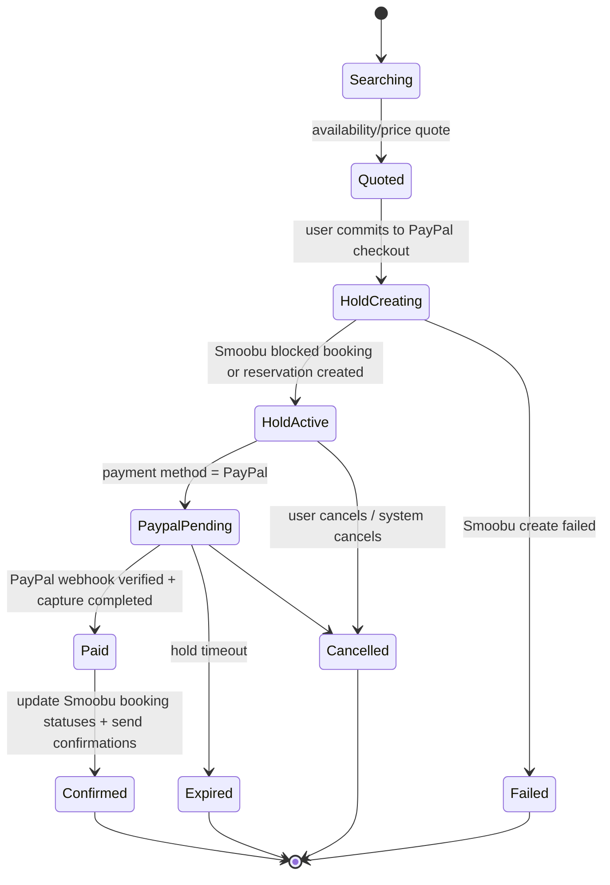
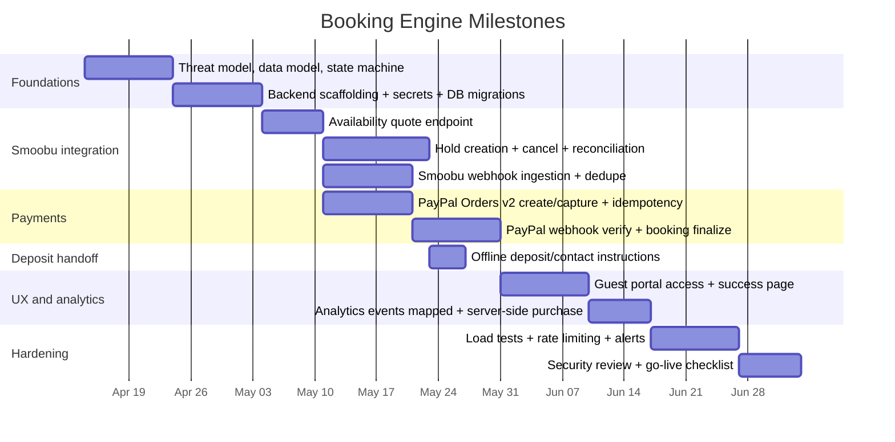

# Secure, Production-Grade Booking Engine Design Using the Smoobu API with PayPal and Manual Deposit

## Executive summary

Building a secure, production-grade booking engine on top of the Smoobu API **is feasible**, but it requires a real backend (as a proxy), a database-backed booking state machine, and webhook-driven reconciliation to achieve the guarantees you care about: “availability shown is real,” “bookings actually happen,” and “payments are confirmed.” Smoobu explicitly warns that its API **cannot be called directly from a front-end** and recommends using a backend proxy service for security reasons. citeturn0search1

Your existing codebase already contains strong foundations for privacy-respecting analytics and Smoobu integration, but it currently relies on the embedded Smoobu BookingTool iframe—not a custom booking engine built on the API. fileciteturn21file0L1-L1 The repo also includes a Smoobu webhook receiver (PHP) that forwards booking events into analytics, but it does not implement a true booking/payment workflow. fileciteturn22file0L1-L1

The key architectural pattern to meet your security goals is:

- **Frontend never talks to Smoobu nor PayPal directly for “write” actions** (create/confirm/cancel bookings).
- **Backend is the only component holding secrets** (Smoobu API key, PayPal credentials, storage signing keys).
- **Booking is a state machine** in your DB, with **idempotency**, **locking/holds**, and **webhook verification**.
- **Smoobu remains the inventory source of truth**, kept in sync via Smoobu webhooks, which Smoobu positions as necessary for real-time correctness (cron alone can’t guarantee correctness). citeturn20search1
- For PayPal, you should rely on **Orders v2**, use **idempotency headers** (`PayPal-Request-Id`), and verify webhooks cryptographically via PayPal’s `verify-webhook-signature` endpoint before acting. citeturn16search4turn2search0

MVP update: there is **no custom admin panel** and no custom deposit approval workflow. PayPal is the automatic confirmation path. Manual deposit is an offline handoff through existing business channels, with staff managing any accepted deposit booking directly in Smoobu or existing operations.

Entities referenced once for quick access: entity["company","PayPal","online payments company"], entity["company","PostHog","product analytics vendor"], entity["company","Meta Platforms","social media company"], entity["company","Google","search and analytics company"], entity["company","GitHub","code hosting platform"], entity["organization","OWASP","web security nonprofit"], entity["organization","NIST","us standards institute"].

## What exists today in TommasoRibaudo/kalawala-web

This repository is a Create React App (CRA) marketing site that already integrates analytics and Smoobu’s embedded booking widget, and it deploys to cPanel via GitHub Actions + FTPS. fileciteturn6file0L1-L1 fileciteturn24file0L1-L1

Key relevant findings:

- **Smoobu booking is currently embedded via the BookingTool iframe script**, initialized client-side (`BookingToolIframe.js`). The component also listens for `postMessage` events originating from `smoobu.com` to infer step changes (listing vs booking form) and captures analytics events. fileciteturn21file0L1-L1  
  - This is not a custom booking engine: you cannot enforce your own booking + payment guarantees at the backend layer because the booking happens in Smoobu’s widget.
- The project runs **PostHog in opt-out-by-default mode** and opts users in only after analytics consent, which is a good privacy pattern. fileciteturn9file0L1-L1  
- There is a fairly comprehensive **cookie consent service** that stores consent state, expires it, and clears tracking cookies when consent is rejected. fileciteturn10file0L1-L1
- The site includes **GA4 gtag** in `public/index.html` and prepares for Meta Pixel (preconnect + a noscript image fallback). fileciteturn13file0L1-L1
- There is a **Smoobu webhook receiver** in `public/smoobu-webhook.php` that:
  - checks a shared secret passed as a **query parameter**,
  - accepts JSON,
  - maps Smoobu actions to PostHog event names,
  - forwards a `/capture/` request to PostHog, and
  - returns HTTP 200 to Smoobu even when PostHog fails (logging error server-side). fileciteturn22file0L1-L1  
- CI/CD includes secret scanning (Gitleaks), dependency auditing, and TypeScript typecheck before deployment; it also generates a PHP config file from secrets at deploy time. fileciteturn24file0L1-L1

Implication: you already have (1) a consent-aware analytics layer and (2) a minimal webhook endpoint deployed to a PHP-capable host. But to implement your required booking/payment security guarantees, you need a real backend booking service + DB (or a substantial expansion of PHP beyond “webhook forwarder”).

## Reference architecture and core state machine

Smoobu’s own documentation frames the first architectural constraint: **“Smoobu API cannot be directly called from your website/front-end application”** and recommends a backend proxy service. citeturn0search1 This dovetails with your core security requirement (“my calendar is not targeteable,” “my info is not exposed”): secrets must not live on the client.

### Architecture overview

```mermaid
flowchart LR
  U[Guest Browser] -->|HTTPS| FE[Frontend UI\nkalawala-web]
  FE -->|HTTPS JSON| BE[Booking API Backend\n(proxy + state machine)]
  BE -->|Api-Key/OAuth| SM[Smoobu API]
  SM -->|Webhooks| WH1[Webhook Receiver\nSmoobu events]
  BE -->|Create/Update/Cancel| SM
  BE --> DB[(Relational DB\nBookings + Holds + Payments)]
  BE --> OBJ[(Object Storage\nDeposit Proof Uploads)]
  U -->|PayPal approval redirect| PP[PayPal Checkout]
  PP -->|Webhooks| WH2[Webhook Receiver\nPayPal events]
  BE -->|Orders v2 create/capture| PP
  BE --> OBS[Monitoring/Logs/Alerts]
```

Why this works for your guarantees:

- **Availability correctness**: the backend queries Smoobu’s availability endpoint in real time and re-validates immediately before creating a hold/booking. citeturn21search0
- **Booking correctness**: the backend creates the booking (or provisional hold) in Smoobu via API and persists Smoobu’s returned reservation ID. citeturn21search0
- **Payment correctness**: PayPal payment completion is confirmed via webhook + signature verification before finalizing the booking state. citeturn2search0turn16search0
- **Real-time sync**: Smoobu webhooks notify you of calendar/rate/booking changes and Smoobu explicitly warns cron jobs alone cannot guarantee correct real-time data. citeturn20search1

Smoobu rate-limits requests (documented as 1000 requests/minute), so caching and throttling are required for production robustness. citeturn0search1

### AWS infrastructure (Terraform-managed)

The backend runs on AWS, with all infrastructure defined as Terraform IaC. This provides repeatable, version-controlled infrastructure with environment separation.

#### Target AWS services

| Component | AWS Service | Purpose |
|---|---|---|
| Booking API | API Gateway + Lambda (Node.js) or ECS Fargate | Backend proxy + state machine logic |
| Database | RDS PostgreSQL (or Aurora Serverless v2) | Booking sessions, holds, payments, webhook events, audit log |
| File storage | S3 (private bucket) | Out of MVP; required only if custom receipt uploads are added later |
| Secrets | AWS Secrets Manager | Smoobu API key, PayPal credentials, webhook secrets, DB credentials |
| Cache | ElastiCache Redis (or DynamoDB TTL) | Availability/rates cache (5–10 min TTL per apartment+month) |
| Webhooks ingress | API Gateway endpoints | PayPal and Smoobu webhook receivers |
| Email/SMS | SES (email) + SNS (SMS) | Transactional booking communications |
| Monitoring | CloudWatch Logs + Alarms | Structured logs, error alerts, booking funnel dashboards |
| CDN/WAF | CloudFront + WAF | Rate limiting, bot protection, DDoS mitigation for public endpoints |

#### Terraform structure

```
infra/
├── main.tf              # Provider config, backend state (S3 + DynamoDB lock)
├── variables.tf         # Input variables (region, environment, domain, etc.)
├── outputs.tf           # API Gateway URL, S3 bucket name, RDS endpoint, etc.
├── vpc.tf               # VPC, subnets, security groups
├── database.tf          # RDS PostgreSQL instance + security group rules
├── lambda.tf            # Lambda functions (or ecs.tf for Fargate)
├── api_gateway.tf       # API Gateway routes, integrations, authorizers
├── s3.tf                # Private S3 bucket if custom receipt uploads are added later
├── secrets.tf           # Secrets Manager entries
├── cache.tf             # ElastiCache Redis cluster
├── ses.tf               # SES domain verification + templates
├── cloudwatch.tf        # Log groups, metric filters, alarms
├── waf.tf               # WAF rules (rate limiting, bot control)
└── environments/
    ├── dev.tfvars
    ├── staging.tfvars
    └── prod.tfvars
```

#### Key decisions

- **State backend**: S3 bucket + DynamoDB table for state locking.
- **Environment separation**: Separate `.tfvars` files for dev/staging/prod.
- **Lambda vs Fargate**: Lambda is simpler and cheaper for low-to-moderate traffic. Switch to Fargate if cold starts become a UX issue.
- **Database**: RDS PostgreSQL with automated backups, encryption at rest, private subnet placement.
- **S3 uploads**: Out of MVP. If custom uploads are added later, bucket policy denies public access and upload/download URLs are time-limited.
- **Secrets rotation**: Secrets Manager with automatic rotation for DB credentials.

### Core state machine and database primatives

A production-grade booking engine should treat booking as a **workflow with explicit states** (not “just create a reservation and hope”). This reduces ambiguity, improves recoverability, and makes fraud/abuse controls possible (rate-limiting, replay protection, idempotency).

Suggested high-level states:



Recommended database tables (minimal but sufficient):

- `apartments`: your internal listing ID ↔ Smoobu `apartmentId`, plus `slug` (the `houseLangCode` value, e.g., `"Geco"`, `"Rana"`) used to build language-aware listing page URLs
- `booking_intents`: immutable record of what the guest attempted (dates, guests, offer/discount, device/session, `language` — `'en'` or `'es'`)
- `holds`: one per intent, includes `smoobu_reservation_id` (nullable until created), expiration, and status
- `payments`: PayPal order IDs / capture IDs
- `documents`: out of MVP; add only if custom receipt uploads are introduced later
- `webhook_events`: dedupe store for webhook event IDs (PayPal event `id`, Smoobu booking `data.id` + action + timestamp)
- `audit_log`: append-only record of security-relevant actions

This structure is specifically designed to address OWASP-style API risks around broken authorization, sensitive business flows, and unsafe consumption of third-party APIs. citeturn12search4turn12search0

## Availability search and booking consistency

### Availability search behavior and the “no houses available” requirement

Your requirement “allow selecting any future date even when no house is available” is primarily a UI/UX rule: never block date-picking; always allow the search request; and if there are no results, show a “no houses available” response.

The backend should implement a `POST /availability/quote` endpoint that:

1. Accepts `{arrivalDate, departureDate, guests}`.
2. Calls Smoobu’s `booking/checkApartmentAvailability` endpoint server-side. citeturn19view2turn21search0
3. Returns:
   - `available: []` if no apartments are available
   - `available: [{apartmentId, price, restrictions?}]` if available  
   Smoobu’s docs indicate the response can include prices and reasons for disapproval when restrictions prevent reservation. citeturn21search0

Security controls for “calendar not targeteable”:

- **Do not expose apartment calendars** (daily availability grids) publicly; expose only “answer a query for a date range.”
- Apply bot controls and rate limits because availability search is a “sensitive business flow” (a known API risk category). citeturn12search4turn12search0
- Implement caching with a short TTL (e.g., 30–120 seconds) keyed by `(arrivalDate, departureDate, guests)` but **always re-check** right before creating a hold/booking.

### Listing redirect behavior (available results → listing page in new tab)

When the booking engine shows available properties in search results, each result card must link to the corresponding listing page on the existing website, opening in a **new browser tab** (`target="_blank"` with `rel="noopener noreferrer"`). This lets the guest browse the full listing (photos, amenities, neighborhood info, reviews) without losing their search context in the booking engine.

#### Language-aware redirect URLs

The existing website uses a **URL-suffix convention** for language:

- English listing pages: `/{PropertyName}` (e.g., `/Geco`, `/Rana`, `/Tucano`, `/Pappagallo`, `/Delfin`, `/Areka`, `/Giulia`, `/Plumeria`, `/VillaMar`, `/VillaCoral`)
- Spanish listing pages: `/{PropertyName}ES` (e.g., `/GecoES`, `/RanaES`, `/TucanoES`, `/PappagalloES`, `/DelfinES`, `/ArekaES`, `/GiuliaES`, `/PlumeriaES`, `/VillaMarES`, `/VillaCoralES`)

The booking engine must detect the guest's current language context and construct the redirect URL accordingly:

- If the guest is using the booking engine in Spanish → link to `/{houseLangCode}ES`
- If the guest is using the booking engine in English → link to `/{houseLangCode}`

The `houseLangCode` field in the property data (`houseDataList` in `src/utils/constants.ts`) maps each property to its URL slug. The backend availability response should include this slug (or the frontend should maintain a `smoobuApartmentId → houseLangCode` mapping) so the correct link can be built.

#### Language detection pattern (existing codebase convention)

The site determines language via URL suffix using `useLanguageDetection()` hook (`src/hooks/useLanguageDetection.ts`):

```ts
const isSpanishPage = location.pathname.endsWith('ES') || 
                     location.pathname.includes('ES/') ||
                     location.pathname === '/HomeES';
```

The booking engine should follow this same convention. If the booking engine lives at a route like `/book` (English) and `/bookES` (Spanish), language detection is automatic. Alternatively, the booking engine can accept a `lang` query parameter or use a React context to propagate language state.

#### UI behavior for result cards

Each available property card in the search results should:

1. Display the property name, thumbnail image, guest capacity, key amenities, and price for the selected dates.
2. Include a clearly visible "View listing" / "Ver alojamiento" link/button (language-dependent).
3. Open the listing page in a new tab on click (`window.open` or `<a target="_blank">`).
4. Also include a "Book now" / "Reservar ahora" action that proceeds to the checkout/hold flow within the booking engine.

This mirrors the existing `HomeCard` component pattern (`src/components/OurHomes/Components/HomeCard.component.tsx`) which navigates to `/${houseLangCode}`, but adapted for new-tab behavior and language awareness.

#### Property slug mapping (backend → frontend)

The backend availability response should include enough data for the frontend to build the redirect URL. Recommended approach:

```ts
// Backend availability response shape
interface AvailableProperty {
  apartmentId: number;        // Smoobu apartment ID
  slug: string;               // e.g., "Geco", "Rana" — maps to houseLangCode
  name: string;               // Display name
  price: number;
  currency: string;
  guestCapacity: number;
  thumbnailUrl: string;
  amenities: string[];
}

// Frontend builds the redirect URL
const listingUrl = isSpanish ? `/${property.slug}ES` : `/${property.slug}`;
```

The `apartments` table in the backend DB (see data models section) should store the `slug` alongside the `smoobu_apartment_id` to enable this mapping.

### Language handling across the booking engine

The booking engine must be fully bilingual (English/Spanish), consistent with the rest of the website. This applies to:

- **Search UI**: date picker labels, guest count label, search button text, "no houses available" message
- **Result cards**: property descriptions, amenity names, "View listing" / "Book now" button labels
- **Checkout flow**: form labels, payment method descriptions, deposit instructions, timer messaging
- **Confirmation/portal pages**: booking summary, status labels, action buttons
- **Email/SMS templates**: all communication templates (hold created, deposit received, booking confirmed, etc.) must be sent in the guest's detected language
- **Error messages**: validation errors, "no longer available" messages, payment/contact handoff errors

The language should be determined at the start of the booking session and persisted in the `booking_session` record (as a `language` field: `'en'` or `'es'`) so that server-side communications (emails, SMS) use the correct language even after the browser session ends.

#### Implementation approach

Follow the existing codebase pattern but use a lightweight i18n approach with a language context and string maps (preferred over duplicating entire components for each language, which is the current pattern for static listing pages):

```ts
// Booking engine string map
const bookingStrings = {
  en: {
    searchButton: "Search availability",
    noResults: "No houses available for these dates",
    viewListing: "View listing",
    bookNow: "Book now",
    depositInstructions: "Complete your deposit",
    holdExpiring: "Your reservation expires in",
  },
  es: {
    searchButton: "Buscar disponibilidad",
    noResults: "No hay casas disponibles para estas fechas",
    viewListing: "Ver alojamiento",
    bookNow: "Reservar ahora",
    depositInstructions: "Complete su depósito",
    holdExpiring: "Su reserva expira en",
  }
};
```

The `LanguageSwitcher` component (`src/components/FlagComponent/Flag.component.tsx`) should also work within the booking engine routes, toggling between `/book` ↔ `/bookES` (or equivalent) and preserving any search state (dates, guests) via query parameters or React state.

### Styling standards for the booking engine UI

The booking engine frontend must follow the existing website's styling conventions to maintain visual consistency:

#### Design tokens (from `src/styles/_variables.scss`)

- Primary colors: `$kalawala-darker-green: #0B3028`, `$kalawala-dark-green: #294F44`, `$kalawala-light-green: #8AA288`
- Text color: `$kalawala-text-gray: #171717`
- Background: `$kalawala-light-cream: #FFFFFFFF`, `$kalawala-opaque-beige: #FFFFFF`
- Fonts: `$primary-font: 'Urbanist', sans-serif` (used for both primary and secondary)

#### Component styling patterns

- Each component has a co-located `.style.scss` file (e.g., `BookingSearch.style.scss`)
- Import global variables via `@import '../../styles/styles.scss'` and mixins via `@use '../../styles/mixins'`
- Use React Bootstrap for grid layout (`Container`, `Row`, `Col`) and responsive behavior
- Responsive breakpoints: `@media (max-width: 992px)` for mobile, `@media (max-width: 1199px)` for tablet
- Class naming follows a BEM-like pattern scoped to the component (e.g., `.booking-search-container`, `.booking-result-card`, `.booking-result-card-overlay`)

#### Result card styling reference

The booking engine result cards should follow the visual pattern of existing `HomeCard` and `OtherListings` components:

- Card with background image, overlay gradient, and property name
- Guest capacity badge with icon
- Amenity icons row (A/C, kitchen, WiFi, parking)
- Hover effect for interactivity
- Accessible: `role="button"`, `tabIndex={0}`, `aria-label`, keyboard navigation support (`onKeyDown` for Enter)

### Listing-page calendar with per-night price dots

When a guest is browsing a specific listing page (e.g., `/Areka` or `/ArekaES`), the booking calendar embedded on that page should display colored dots on each date indicating the nightly price tier relative to the visible month's average. Unavailable dates show a grey dot. This gives guests an at-a-glance sense of pricing without requiring them to select dates first.

#### Data source: Smoobu `GET /api/rates`

The Smoobu Rates API returns per-day pricing and availability for one or more apartments over a date range:

```
GET https://login.smoobu.com/api/rates?apartments[]=<apartmentId>&start_date=YYYY-MM-DD&end_date=YYYY-MM-DD
```

Response shape per apartment per date:

```json
{
  "<apartmentId>": {
    "2026-06-15": {
      "price": 120.00,
      "min_length_of_stay": 2,
      "available": 1
    },
    "2026-06-16": {
      "price": null,
      "min_length_of_stay": null,
      "available": 0
    }
  }
}
```

- `price`: nightly rate (null if no price set)
- `available`: `1` = available, `0` = unavailable
- `min_length_of_stay`: minimum nights (useful for future validation)

This endpoint is called **server-side only** (Smoobu API keys must never reach the browser). The backend proxies the data to the frontend.

#### Backend endpoint: `GET /api/calendar/:apartmentSlug`

```
GET /api/calendar/Areka?month=2026-06
```

Response:

```json
{
  "apartment": "Areka",
  "month": "2026-06",
  "dates": {
    "2026-06-01": { "price": 95.00, "available": true, "minStay": 2 },
    "2026-06-02": { "price": 110.00, "available": true, "minStay": 2 },
    "2026-06-03": { "price": null, "available": false, "minStay": null },
    ...
  },
  "stats": {
    "avg": 105.50,
    "min": 85.00,
    "max": 150.00
  }
}
```

The backend computes `stats` from the available dates in the response (excluding unavailable dates from the average). The frontend uses these stats to classify each date.

#### Dot color classification

For each date in the visible month, compute the dot color based on the month's average price of available dates:

| Condition | Dot color | Meaning |
|---|---|---|
| `available === false` | Grey | Night unavailable |
| `price <= avg * 0.85` | Green | Low price (≤15% below average) |
| `price > avg * 0.85 && price <= avg * 1.15` | Yellow | Around average (within ±15%) |
| `price > avg * 1.15` | Red | High price (>15% above average) |

The thresholds (0.85 / 1.15) are configurable. The frontend renders a small colored circle on each calendar date cell.

#### Lazy loading and efficient polling strategy

The calendar must minimize API calls while keeping the UX responsive:

1. **Initial load (current month)**: When the listing page loads, the frontend requests the current visible month's data from the backend. The backend calls Smoobu `GET /api/rates` for that month's date range for the specific apartment and caches the result (TTL: 5–10 minutes, keyed by `apartmentId + month`).

2. **User navigates to a different month**: When the guest clicks "next month" or selects a future date in a different month:
   - **Priority fetch**: The backend immediately returns data for the **selected date** (or the full target month if already cached).
   - **Background fill**: If the month wasn't cached, the backend fetches the full month from Smoobu and returns it. The frontend renders dots progressively — the selected date's dot appears first, then the rest of the month fills in as data arrives.
   - In practice, since Smoobu returns the full date range in one call, the "priority fetch" and "background fill" happen in the same request. The perceived optimization is on the frontend: show the calendar immediately with a loading state, then paint dots once data arrives.

3. **Caching rules**:
   - Backend caches `GET /api/rates` responses per `(apartmentId, month)` with a 5–10 minute TTL.
   - Past months are never fetched (calendar only shows current + future months).
   - Smoobu `updateRates` webhooks should invalidate the cache for affected apartments/dates.
   - Respect Smoobu's 1000 req/min rate limit; the per-month granularity and caching ensure this is never approached under normal usage.

4. **Recalculated average per month**: Each month has its own average. When the user navigates to July, the dots reflect July's average — not June's. This means a $120/night that was "red" in a cheap June could be "green" in an expensive July.

#### Frontend component behavior

```
CalendarWithPriceDots
├── props: apartmentSlug, language
├── state: visibleMonth, monthData (map of month → dates+stats), loading
├── on mount: fetch current month
├── on month change: fetch new month if not cached locally
├── render: calendar grid with colored dot per date cell
```

Each date cell renders:

```tsx
<div className="calendar-date-cell">
  <span className="date-number">{day}</span>
  <span
    className={`price-dot price-dot--${getDotColor(date, monthData)}`}
    aria-label={getAriaLabel(date, monthData, language)}
  />
</div>
```

Where `getDotColor` returns `'grey'` | `'green'` | `'yellow'` | `'red'` and `getAriaLabel` returns a screen-reader-friendly description like "June 15, $120, above average price" / "15 de junio, $120, precio por encima del promedio" (language-aware).

#### Styling for price dots

```scss
.price-dot {
  width: 8px;
  height: 8px;
  border-radius: 50%;
  display: inline-block;
  margin-top: 2px;

  &--green  { background-color: #4CAF50; }
  &--yellow { background-color: #FFC107; }
  &--red    { background-color: #F44336; }
  &--grey   { background-color: #BDBDBD; }
}
```

These colors should be defined as SCSS variables in the booking engine's stylesheet, complementing the existing Kalawala palette. The dot size and spacing should be tested at mobile breakpoints to ensure they remain visible without cluttering the calendar.

#### Analytics events for calendar interaction

| Moment | Event name | Key properties |
|---|---|---|
| Month data loaded | `calendar_month_loaded` | `apartment_slug`, `month`, `available_count`, `avg_price`, `source` (cache/api) |
| User navigates month | `calendar_month_changed` | `apartment_slug`, `from_month`, `to_month` |
| User clicks a date | `calendar_date_selected` | `apartment_slug`, `date`, `price`, `dot_color`, `available` |

### Provisional holds: local hold vs provisional Smoobu reservation

You asked for detailed deposit behavior: “we ask for info, block the house, show page with 1h timer, upload deposit picture.” The central question is where to enforce the “block”:

- **Option A**: create a provisional reservation/blocked booking in Smoobu immediately
- **Option B**: create only a local hold in your DB, and create the Smoobu reservation later

Smoobu supports cancellation via `DELETE /api/reservations/<reservationId>` (returns `{"success": true}`), which is necessary for expiring holds. citeturn19view1turn21search0 Also, Smoobu’s channel list includes a “Blocked channel” (ID 11), which is a strong indication the platform supports explicit blocking entries. citeturn19view3turn21search0

#### Option comparison table

| Dimension | Option A: Provisional Smoobu reservation/blocked booking | Option B: Local hold only (no Smoobu write until paid) |
|---|---|---|
| Availability correctness shown to guest | Strong: you can block inventory at the source (Smoobu) immediately after quote acceptance | Weaker: other channels/users can book in Smoobu while you “hold” locally |
| Double-booking risk | Low if you always use Smoobu as lock source | Higher unless you accept occasional “payment but no inventory” refunds |
| Operational cleanup | Needs automated expiry + cancel call to Smoobu citeturn19view1turn21search0 | Simple locally, but inventory not protected |
| Guest experience | Better: “we reserved for you” messaging is truthful | Risky: you may need to inform guest inventory was lost |
| Implementation complexity | Medium: requires Smoobu create + cancel + webhook reconciliation | Medium: requires complex compensation logic and refunds |
| Security: calendar targetability | Similar at API level (both require rate limits); Option A reduces abuse impact by locking inventory | Similar, but abuse can help bots “race” inventory |

**Recommendation:** Option A (provisional Smoobu reservation / blocked booking) is the best fit for your priority: “when a date is shown as available … it actually is” and “when a booking is done … it actually does happen.” Smoobu is your inventory system, so use it as the locking authority.

Implementation notes supported by Smoobu docs:

- Smoobu availability: `POST /booking/checkApartmentAvailability`. citeturn19view2turn21search0  
- Smoobu booking creation: `POST /api/reservations` returns a booking ID. citeturn19view0turn21search0  
- Smoobu booking update supports payment status fields such as `priceStatus`, `depositStatus` and the docs enumerate “0 open/not paid, 1 complete payment.” citeturn21search0  
- Smoobu can explicitly represent blocked bookings (`is-blocked-booking` appears in booking responses). citeturn21search0turn19view3

## Payment flows

### PayPal flow with webhook verification and idempotency

A secure PayPal integration should treat the PayPal webhook as the source of truth for payment completion and implement idempotent processing.

Key PayPal primitives from official docs:

- Orders v2 supports creating orders and capturing payment: `POST /v2/checkout/orders/{id}/capture`. citeturn16search4  
- PayPal recommends idempotency via `PayPal-Request-Id` for calls that create/modify data. citeturn16search4turn0search2  
- For end-to-end checkout you should subscribe to events including `CHECKOUT.ORDER.APPROVED` and `PAYMENT.CAPTURE.COMPLETED`. citeturn16search0  
- Webhook signature verification is supported via `POST /v1/notifications/verify-webhook-signature` (using headers like `PAYPAL-TRANSMISSION-ID`, `PAYPAL-TRANSMISSION-SIG`, etc.). citeturn2search0turn20search0

#### Recommended PayPal booking sequence

1. **Guest selects dates + listing** → backend creates a quote (Smoobu availability check).
2. Guest clicks “Pay with PayPal” → backend:
   - creates a `booking_intent`
   - creates a provisional Smoobu block/reservation (Option A)
   - creates a PayPal order for the required amount (deposit or full)
   - stores `paypal_order_id` + idempotency key in DB
3. Guest approves PayPal payment (redirect/SDK) → backend captures:
   - either immediately when the guest returns (synchronous capture)
   - or on `CHECKOUT.ORDER.APPROVED` then capture
4. Backend waits for/consumes `PAYMENT.CAPTURE.COMPLETED` webhook and verifies signature.
5. Backend transitions booking to `Paid → Confirmed` and updates any payment fields in Smoobu, then emails guest.

#### Sample webhook verification logic (pseudocode)

```ts
// PayPal webhook handler (Node-style pseudocode)
//
// Required: verify signature via PayPal API before processing.
// Docs: /v1/notifications/verify-webhook-signature citeturn2search0turn20search0

async function handlePayPalWebhook(req, res) {
  const headers = req.headers
  const event = req.body // raw JSON parsed

  // 1) Dedupe early
  if (await db.webhookEvents.exists(event.id)) return res.status(200).send("duplicate")

  // 2) Verify signature
  const verification = await paypal.verifyWebhookSignature({
    auth_algo: headers["paypal-auth-algo"],
    cert_url: headers["paypal-cert-url"],
    transmission_id: headers["paypal-transmission-id"],
    transmission_sig: headers["paypal-transmission-sig"],
    transmission_time: headers["paypal-transmission-time"],
    webhook_id: process.env.PAYPAL_WEBHOOK_ID,
    webhook_event: event
  })

  if (verification.verification_status !== "SUCCESS") {
    // store attempt for security review; do not process
    await db.webhookEvents.insert({ id: event.id, status: "rejected_signature" })
    return res.status(400).send("invalid signature")
  }

  // 3) Process idempotently in a DB transaction
  await db.transaction(async (tx) => {
    await tx.webhookEvents.insert({ id: event.id, status: "verified" })

    switch (event.event_type) {
      case "PAYMENT.CAPTURE.COMPLETED":
        // find booking by paypal_order_id or capture_id
        // update payment + booking state, then confirm in Smoobu
        break
      case "PAYMENT.CAPTURE.DENIED":
        // cancel hold in Smoobu + mark booking cancelled
        break
      default:
        // ignore or store for audit
    }
  })

  return res.status(200).send("ok")
}
```

#### Idempotency rules you should enforce

- **PayPal API calls**: always set `PayPal-Request-Id` on create/capture. citeturn16search4turn0search2  
- **Webhook processing**: store PayPal `event.id` in `webhook_events` with a UNIQUE constraint to prevent double-processing from retries.
- **Booking confirmation**: your internal `booking_id` should be the idempotency anchor; confirmation must be safe to retry.

### Manual deposit handoff

You described:

- ask for guest info
- block the house
- show deposit instructions page with 1-hour timer (fake)
- guest uploads deposit picture
- guest can contact you to explain problems (skips timer, which does nothing)

This custom automated flow is now **out of MVP scope** because it requires an admin approval/review interface that you do not want. The MVP keeps manual deposit as an offline handoff only.

#### MVP deposit behavior

1. Guest can choose manual deposit/contact instead of PayPal.
2. The site shows bank/contact instructions and clearly says the booking is not confirmed by the custom engine.
3. The site does not upload receipt files, approve deposits, or show a custom confirmed state for deposit.
4. Staff handles the deposit conversation and any accepted booking directly in Smoobu or existing business tools.
5. Any future automated deposit workflow requires a separate PRD update because it reintroduces privileged approval operations.

## Guest portal access and communications

### Deposit proof upload security

MVP does not include custom deposit receipt upload. If this feature is added later, the OWASP File Upload Cheat Sheet controls below still apply.

A secure approach:

- **Use signed upload URLs** (frontend uploads directly to object storage; backend issues short-lived signed URL).
- **Never make the object publicly readable**; serve via authenticated download endpoint.
- Validate:
  - file size limits (e.g., <10 MB)
  - allowed extensions (jpeg/png/pdf only)
  - detected MIME type via server-side sniffing (not just header)
  - file signatures/magic bytes per OWASP guidance citeturn0search0
- **Scan** uploads (e.g., ClamAV, managed scanning).
- Store metadata in DB: checksum, detected MIME, scan status, storage key.
- Consider “content disarm and reconstruct” for PDFs if you allow them. citeturn0search0

### Guest portal: reservation ID + user-generated password

Your requirement: a “success page … reservation ID + user-generated password access to manage booking.”

This is feasible and relatively privacy-preserving if implemented as a **password-based access token** rather than a full guest account system.

Minimum viable secure design:

- On booking creation/confirmation:
  - generate a `reservation_public_id` (non-guessable; not sequential; e.g., base32 random 16–20 chars)
  - ask guest to set a password (or generate and email a one-time code)
- Store only a salted password hash (Argon2/bcrypt/scrypt), never plaintext.
- Enforce password policy aligned with NIST guidance (e.g., allow long passwords, avoid arbitrary composition rules, store salted hashes resistant to offline attack). citeturn12search1
- Rate limit login attempts and protect against enumeration (same response for “ID not found” vs “wrong password”).

Portal capabilities (safe subset):

- View booking summary + payment status
- Request changes (sends message to staff)
- Cancel request (depending on policy)

### Communication templates

Use transactional email/SMS at each state transition; keep messages short, include the next action, and include the booking reference.

**Template: Manual deposit handoff**  
Subject: “Manual deposit instructions — {{property_name}}”  
Body:  
“Hi {{first_name}},  
Manual deposit is handled directly by Kalawala staff.  
Please contact us here: {{contact_url}}.  
Your booking is not confirmed until staff confirms it through our existing process.”

**Template: Booking confirmed (PayPal)**  
Subject: “Booking confirmed — {{property_name}}”  
Body:  
“Confirmed! Your stay is booked from {{check_in}} to {{check_out}}.  
Reservation ID: {{reservation_public_id}}  
Manage your booking: {{portal_url}}”

**Template: Hold expiring soon** (optional)  
Subject: “Reminder: your reservation expires soon”  
Body:  
“Your temporary reservation will expire at {{expires_at}} unless PayPal payment is completed.”

These templates should be triggered server-side on state transitions to avoid client-side spoofing and to guarantee delivery even if the browser closes mid-flow.

## Analytics events mapping for Meta Pixel, PostHog, and GA4

Your repo already has consent-aware analytics initialization and custom tracking around the Smoobu iframe. fileciteturn9file0L1-L1 fileciteturn21file0L1-L1 For a new booking engine, you should track events at both:

- **client side** (UX funnel; subject to blockers)
- **server side** (source of truth for booking/payment outcomes)

PostHog’s JS docs describe opt-out-by-default (`opt_out_capturing_by_default`) and opt-in/out methods (`posthog.opt_in_capturing()` / `posthog.opt_out_capturing()`). citeturn7view0 This matches your repo’s implementation. fileciteturn9file0L1-L1

GA4 has recommended ecommerce events like `begin_checkout`, `add_payment_info`, and `purchase`. citeturn2search2 It also supports the Measurement Protocol for sending events server-to-server, which is useful for reliable conversion tracking and back-office events. citeturn17search0turn17search3

For Meta Pixel standard purchase tracking, “Purchase requires currency” is a commonly enforced requirement in integrations. citeturn11search2 For server + browser deduplication patterns, Segment documentation describes event ID usage to deduplicate between Pixel and Conversions API. citeturn9search6

### Unified analytics event map

Below is a pragmatic event plan tailored to **booking**, not generic ecommerce.

| Moment | PostHog event | GA4 event | Meta Pixel event | Trigger | Key properties (examples) | Sample payload snippet |
|---|---|---|---|---|---|---|
| User searches dates | `booking_search` | `view_item_list` (or custom `booking_search`) | `Search` | After availability quote returned | `arrival_date`, `departure_date`, `guests`, `results_count`, `source` | `posthog.capture('booking_search', {...})` |
| Quote shown | `booking_quote_viewed` | `select_item` / custom | `ViewContent` | When results render | `apartment_id`, `total_price`, `currency`, `nights` | `gtag('event','select_item', {...})` |
| User begins checkout / commits | `begin_checkout` | `begin_checkout` citeturn2search2 | `InitiateCheckout` | When hold is successfully created | `booking_id`, `payment_method`, `value`, `currency` | `fbq('track','InitiateCheckout',{value, currency})` |
| Payment method chosen | `add_payment_info` | `add_payment_info` citeturn2search2 | `AddPaymentInfo` | When user selects PayPal or manual deposit handoff | `payment_type` (`paypal`/`manual_deposit_handoff`) | `gtag('event','add_payment_info',{payment_type:'paypal'})` |
| Manual deposit handoff clicked | `manual_deposit_handoff_clicked` | custom | (custom) | When guest clicks offline contact/deposit handoff | `contact_method`, `booking_context` | server-side or client-side PostHog capture |
| PayPal approved | `paypal_order_approved` | custom | (optional) | On return from PayPal approval | `paypal_order_id` | — |
| Payment confirmed | `purchase` | `purchase` citeturn2search2 | `Purchase` | **Server-side** on PayPal `PAYMENT.CAPTURE.COMPLETED` citeturn16search0 | `transaction_id`, `value`, `currency`, `booking_id`, `apartment_id` | `fbq('track','Purchase',{value,currency})` |
| Booking cancelled/expired | `booking_cancelled` | custom | (optional) | When hold canceled/expired | `reason` | — |

#### Sample payloads

**PostHog client event** (pattern already used in your repo) fileciteturn21file0L1-L1  
```js
posthog.capture('begin_checkout', {
  booking_id: 'BK_ABC123',
  apartment_id: 38,
  arrival_date: '2026-06-10',
  departure_date: '2026-06-14',
  value: 520,
  currency: 'USD',
  payment_method: 'paypal'
})
```

**GA4 measurement protocol server-side** (useful for reliable purchase events)  
Measurement Protocol is designed for sending events directly to GA servers. citeturn17search0turn17search3  
```json
{
  "client_id": "1857116524.1675709798",
  "events": [{
    "name": "purchase",
    "params": {
      "transaction_id": "BK_ABC123",
      "value": 520,
      "currency": "USD"
    }
  }]
}
```

**Meta Pixel Purchase event**  
Many integrations require currency for purchase events. citeturn11search2  
```js
fbq('track', 'Purchase', {
  value: 520.00,
  currency: 'USD'
})
```

If you later add Meta Conversions API (server-side), ensure deduplication via event IDs as described in Segment’s guidance. citeturn9search6

## Security, monitoring, operational handoff, edge cases, and PRD

### Security checklist

Use this as a production gate; it aligns with common OWASP API risks and secure storage guidance. citeturn12search4turn18search1turn18search0

| Area | Control | Why it matters | Source anchor |
|---|---|---|---|
| Secrets | Use a secrets manager; don’t hardcode keys | Prevent credential leaks | citeturn18search1turn18search0 |
| Transport | HTTPS everywhere + HSTS | Prevent downgrade/MITM | citeturn18search3 |
| Webhooks (PayPal) | Verify signature before processing | Prevent spoofed payment events | citeturn2search0turn20search0 |
| Webhooks (Smoobu) | Use secret path/token + rate limit + dedupe | Smoobu webhooks don’t document signatures; prevent replay/abuse | citeturn20search1 |
| Idempotency | `PayPal-Request-Id` + webhook event dedupe table | Prevent double charges / double confirms | citeturn16search4turn0search2 |
| File uploads | Out of MVP; if added later, allowlist types, rename, store outside webroot, scan | Prevent malicious file execution/data leakage | citeturn0search0turn0search4 |
| Auth to guest portal | Salted password hashes + rate limit | Prevent credential stuffing/enumeration | citeturn12search1 |
| Abuse prevention | Rate limit availability searches + CAPTCHA when needed | Protect sensitive business flow | citeturn12search4turn12search0 |

### Monitoring and alerting

Minimum observability signals:

- **Booking funnel health**:
  - holds created per day
  - holds expired
  - PayPal approved vs captured
  - manual deposit handoff clicked
- **Mismatch detection**:
  - “Confirmed in DB but missing in Smoobu” (reconciliation job)
  - Smoobu webhook spikes / failures
- **Security alerts**:
  - webhook signature failures (PayPal)
  - repeated failed portal logins by IP
  - availability quote rate limit triggers

Because Smoobu recommends webhooks for real-time correctness and warns cron jobs can’t guarantee correctness, you should still run a **periodic reconciliation** as a defense-in-depth backup (e.g., every 15–60 minutes fetch upcoming reservations and compare with DB). citeturn20search1turn21search0

### No custom admin panel in MVP

The MVP does not include an admin dashboard, deposit review queue, hold-extension button, or custom booking-cancellation UI. Staff handle manual deposit exceptions directly in Smoobu or existing business tools.

### Edge cases and recovery table

| Failure mode | Symptom | Likely cause | Recovery |
|---|---|---|---|
| Availability shown but booking fails on confirm | Guest hits “pay” and gets failure | Race condition with other booking | Auto-release flow, re-run availability check, offer alternatives/next dates |
| PayPal capture succeeds but webhook delayed | Payment done, booking still pending | webhook delivery delay / downtime | Poll PayPal order status; finalize when capture confirmed; keep idempotent |
| PayPal webhook spoof attempt | Unexpected “paid” webhook | attacker posts fake webhook | Reject unless signature verifies citeturn2search0turn20search0 |
| Deposit proof upload malware | N/A in MVP | custom receipt uploads are out of scope | If added later: quarantine + scan; never serve raw file publicly citeturn0search0 |
| Smoobu webhook missed | DB stale | network/host issue | reconciliation job to pull Smoobu reservations and reconcile citeturn20search1 |

### PRD

Task 1.2 froze the MVP PRD in `docs/own_booking_engine/prd.md`. The frozen PRD is the implementation source of truth for PayPal, offline deposit handoff, portal, non-functional requirements, operational handoff, success metrics, and change-control decisions.

**Problem statement**  
Implement a secure booking engine integrated with Smoobu that provides real-time availability, prevents double bookings, supports PayPal payments, offers an offline manual-deposit handoff, and provides PayPal-confirmed guests a secure portal to manage their reservation.

**Goals**
- Availability shown is accurate (validated server-side using Smoobu API). citeturn21search0
- Booking creation/holds are reliable and race-safe (Smoobu-based holds recommended).
- Payments are confirmed before final confirmation (PayPal webhooks verified). citeturn2search0turn16search0
- Guest and operator data is protected (no secret leakage; minimal PII retention). citeturn18search1turn18search0

**Non-goals**
- Replacing Smoobu as the system of record for property management.
- Supporting every possible payment provider (only PayPal + manual deposit).

**Key features and acceptance criteria**

| Feature | Acceptance criteria |
|---|---|
| Availability search | Selecting any future dates is allowed; results can be empty; backend uses Smoobu availability endpoint; response includes `results_count` and property summaries. citeturn21search0 |
| Hold creation | When user starts checkout, backend creates a hold in Smoobu and persists Smoobu reservation ID. citeturn21search0turn19view0 |
| PayPal payment | System uses Orders v2; capture is idempotent using `PayPal-Request-Id`; booking is confirmed only after verified webhook/capture completion. citeturn16search4turn2search0turn16search0 |
| Manual deposit handoff | Deposit option shows offline contact/payment instructions and clearly states the custom engine does not confirm deposit bookings automatically. |
| Secure uploads | Out of MVP; no custom receipt upload is implemented. |
| Guest portal | Guest can access with reservation ID + password; password stored as salted hash; rate-limited logins. citeturn12search1 |
| Webhooks | PayPal signature verified; Smoobu actions ingested idempotently; webhook events stored for replay protection. citeturn2search0turn20search1 |
| Observability | Dashboards/alerts for payment-webhook failures, booking confirmation failures, and hold expiries. |

**Backend API endpoints (suggested)**  
(Names are illustrative; the backend remains the only layer that calls Smoobu/PayPal.)

- `POST /api/availability/quote`
- `GET /api/calendar/:apartmentSlug?month=YYYY-MM` — returns per-day price, availability, min stay, and month stats (avg/min/max) for the listing-page calendar price dots
- `POST /api/bookings/hold`
- `POST /api/bookings/:booking_id/paypal/create-order`
- `POST /api/bookings/:booking_id/paypal/capture`
- `GET /api/deposit-handoff` or static localized deposit/contact instructions
- `POST /api/webhooks/smoobu`
- `POST /api/webhooks/paypal`
- `POST /api/portal/login`
- `GET /api/portal/bookings/:reservation_public_id`

**Data models (core fields)**

- `bookings`: `id`, `reservation_public_id`, `smoobu_reservation_id`, `apartment_id`, `arrival`, `departure`, `status`, `price`, `currency`, `payment_method`, `language` (`'en'` | `'es'` — persisted at session start for server-side communications)
- `payments`: `booking_id`, `provider`, `paypal_order_id`, `paypal_capture_id`, `status`, `amount`
- `webhook_events`: `provider`, `event_id`, `received_at`, `processed_at`, `status`

**Test cases**
- Concurrency: two users attempt same apartment/dates; only one reaches Confirmed.
- Webhook replay: send same PayPal event twice → only one processed.
- Invalid PayPal signature → no state change.
- Upload: malicious content-type mismatch → rejected/quarantined. citeturn0search0
- Expiry: hold expires → Smoobu reservation canceled and dates become available. citeturn19view1

### Delivery milestones and timeline



### Open questions to resolve later

- How exactly do you want to represent “blocked” holds in Smoobu: “Blocked channel (ID 11)” vs “Direct booking” with a custom flag? citeturn19view3turn21search0  
- Should PayPal collect the full amount or only a deposit amount?
- Do you need partial refunds, date changes, or cancellation fees in the portal?
- Which offline contact/payment instructions should be shown for manual deposit?
- Which email/SMS provider will you use for transactional communications?
- Data retention policy for guest PII (duration, deletion process). citeturn18search0

### Prioritized recommendations and next steps

1. Implement the **backend proxy + DB state machine** first (this is the security foundation). citeturn0search1turn12search4  
2. Choose **Option A (provisional Smoobu hold)** to guarantee availability and prevent double-booking. citeturn19view3turn19view1turn21search0  
3. Implement PayPal with **webhook verification + idempotency** as non-negotiable controls. citeturn2search0turn16search4turn16search0  
4. Keep manual deposit as an offline handoff unless a future PRD explicitly adds a privileged approval workflow.  
5. Add server-side analytics for “purchase/confirmed” outcomes (GA4 Measurement Protocol + PostHog backend capture) to reduce adblock-induced blind spots. citeturn17search0turn7view0

### CI/CD: frontend vs backend deployment separation

The existing GitHub Actions workflow (`.github/workflows/main.yml`) deploys **only the React frontend** to cPanel via FTPS. It runs `npm run build` and uploads the `build/` folder. Backend code in `infra/` or `backend/` directories does not end up in `build/`, so it won't accidentally reach the frontend server — but there is currently **no pipeline to deploy the backend or Terraform infrastructure**.

#### Current workflow (frontend only — unchanged)

```
main.yml: push to main → secret-scan → audit → typecheck → npm run build → FTP upload build/ to cPanel
```

#### Required: separate backend workflow

A new `.github/workflows/deploy-backend.yml` is needed with:

1. **Path filtering** — only triggers on changes to `infra/` or `backend/`, so frontend-only pushes don't re-deploy infrastructure.
2. **Terraform plan/apply** — provisions AWS resources (VPC, RDS, Lambda, API Gateway, S3, ElastiCache, WAF, SES, CloudWatch).
3. **Lambda code deploy** — packages backend code, uploads to S3, updates Lambda function (either via Terraform `aws_lambda_function` resource or `aws lambda update-function-code` CLI).
4. **AWS auth** — OIDC federation (preferred) or GitHub Secrets for `AWS_ACCESS_KEY_ID` / `AWS_SECRET_ACCESS_KEY`.
5. **Environment protection** — GitHub Environments with required reviewers for prod Terraform applies.

This ensures the two deployment pipelines are fully isolated: frontend changes go to cPanel, backend/infra changes go to AWS.
