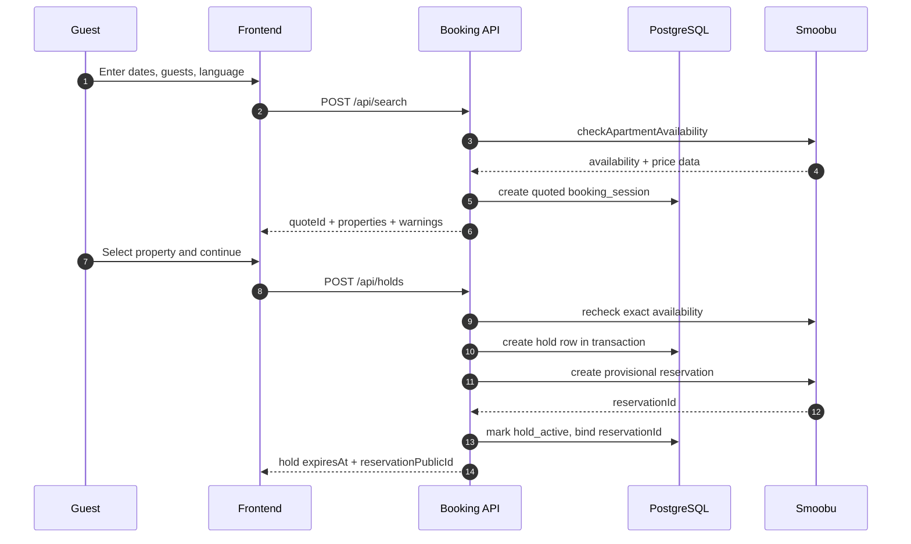
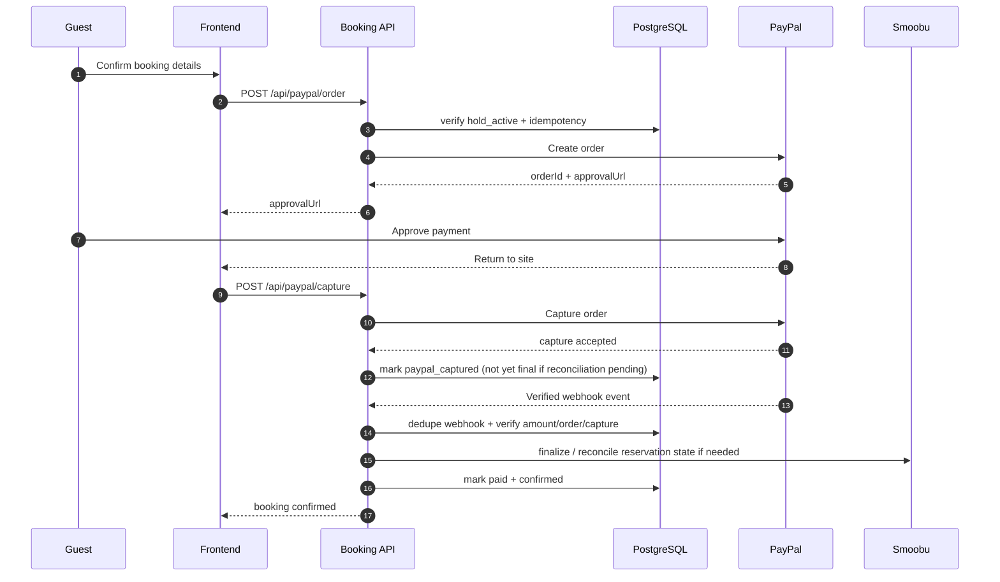
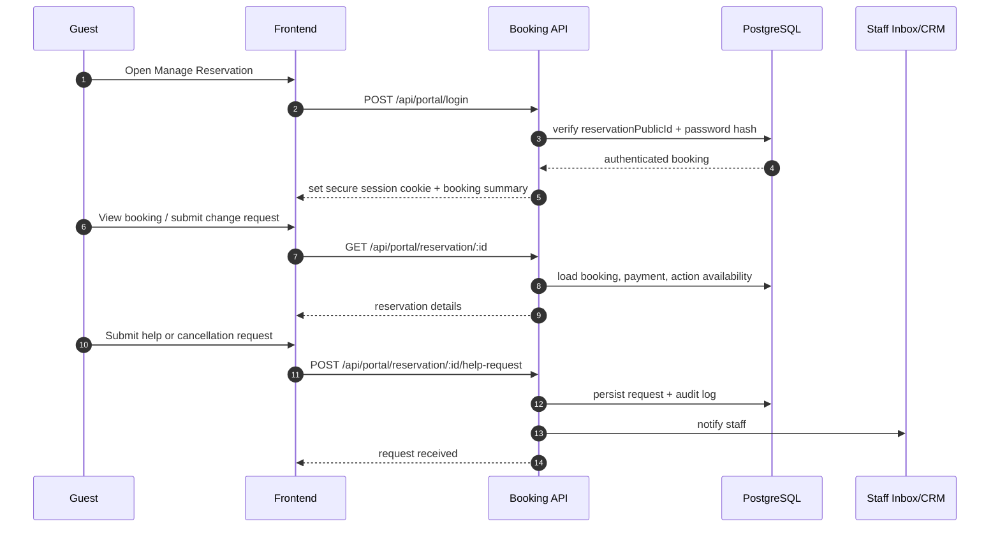

# Booking Engine Branch Assessment

## Executive summary

The `booking-engine` branch is a strong architecture-and-scaffold branch, but it is **not yet business-ready as a production booking engine**. The branch contains substantial design work, an actual backend scaffold, a real Smoobu-backed availability search path, a typed property catalog, abuse-protection and observability foundations, and Terraform plus CI/CD scaffolding. But the transactional parts that make a booking engine commercially reliable—**durable session storage, real reservation holds, PayPal order/capture, verified webhook processing, post-booking management, and production deployment of backend code**—are still missing or explicitly stubbed with `notImplemented(...)`. The most important hard blockers are: in-memory quote/session storage, placeholder Smoobu apartment IDs, unimplemented hold/payment/portal routes, and an incomplete deployment path for Lambda code. fileciteturn10file0L1-L1 fileciteturn18file0L1-L1 fileciteturn19file0L1-L1 fileciteturn20file0L1-L1 fileciteturn21file0L1-L1

My bottom-line assessment is that the branch is roughly **design-complete for the MVP architecture, scaffold-complete for the core backend shell, but functionally incomplete for booking operations**. In practical terms: the branch can support **search and architecture validation**, but not **money movement or reservation commitments**. That means it is suitable for technical review, internal demos, and incremental development, but not for public launch. This is an inference from the inspected code and task list, not a claim made by the repository itself. fileciteturn6file0L1-L1 fileciteturn10file0L1-L1 fileciteturn18file0L1-L1

The branch is built around server-side integrations with entity["company","Smoobu","vacation rental software"], entity["company","PayPal","payments platform"], and entity["company","Amazon Web Services","cloud provider"]. The design intent is sound: backend-only provider access, a PostgreSQL-backed state machine, webhook-driven reconciliation, idempotent writes, and anti-abuse controls. The implementation, however, is still one phase away from converting that design into a dependable booking product. fileciteturn6file0L1-L1 fileciteturn10file0L1-L1 fileciteturn11file0L1-L1 fileciteturn12file0L1-L1

## Scope and evidence

I prioritized the specified repository, `TommasoRibaudo/kalawala-web`, branch `booking-engine`, and especially `docs/own_booking_engine/tasks.md`. The strongest evidence came from the task plan itself, the API contract, the data model, the backend README, the Lambda app/router/search implementation, the property catalog, the Smoobu client, and the Terraform / deployment workflow files. Where the checklist marked work complete but I did not inspect direct implementation evidence—most notably front-end booking UI tasks—I classify those items as **unverified**, not absent. fileciteturn6file0L1-L1 fileciteturn10file0L1-L1 fileciteturn11file0L1-L1 fileciteturn12file0L1-L1

The repository evidence shows a clear split between **designed behavior** and **implemented behavior**. Designed behavior is documented in detail in `tasks.md`, `api_contract.md`, and `data_model.md`. Implemented behavior exists mainly in the backend shell: a handler, router, request parsing, route hardening, basic abuse controls, a live search path against Smoobu, and an extensible Smoobu client. The booking-critical routes—holds, PayPal order/capture, webhooks, deposit handoff, portal login, reservation retrieval, and cancellation/help request handling—exist as route declarations but currently throw `notImplemented(...)`. fileciteturn11file0L1-L1 fileciteturn12file0L1-L1 fileciteturn17file0L1-L1 fileciteturn18file0L1-L1

## Implementation status versus tasks

The clearest way to describe completeness is to separate **documents/scaffolding** from **working booking capability**.

| Task area from `tasks.md` | `tasks.md` status | Concrete repo evidence | Assessment |
|---|---|---|---|
| Threat model, PRD, data model, API contract | Marked complete | `tasks.md`, `api_contract.md`, `data_model.md` exist and are detailed | **Complete as documentation** |
| Backend scaffold, hardening, secrets, observability baseline | Marked complete | `booking-api/README.md`, `src/app.ts`, router, request parsing, route hardening, abuse controls, observability hooks | **Largely complete as scaffold** |
| Terraform scaffold, networking, RDS, Lambda/API Gateway, support services | Marked complete | `infra/main.tf`, `infra/variables.tf`, deploy workflow exist | **Present as infrastructure code scaffold** |
| Smoobu client, availability search, property catalog | Marked complete | `src/smoobuClient.ts`, `src/search.ts`, `src/propertyCatalog.ts` | **Partially complete; usable for search only** |
| Search UI, listing redirect, i18n, styling | Marked complete | API supports slugs/listing URLs and localized amenity labels, but I did not inspect sufficient front-end files | **Unverified from inspected code** |
| Calendar backend and price dots | Marked incomplete | `/api/calendar/:apartmentSlug` route exists but throws `notImplemented` | **Not implemented** |
| Hold creation, expiry worker, manual deposit handoff | Mostly incomplete | `/api/holds` stubbed; `/api/deposit-handoff` stubbed; design exists | **Not implemented** |
| PayPal Orders, capture, webhooks, reconciliation | Incomplete | `/api/paypal/order`, `/api/paypal/capture`, `/api/webhooks/paypal` are scaffolded but stubbed | **Not implemented** |
| Smoobu webhooks, communications, portal auth/pages | Incomplete | route declarations exist; Smoobu secret check exists; portal routes stubbed | **Mostly not implemented** |
| Analytics schema, load testing, launch readiness | Incomplete | observability baseline exists; no proof of full funnel analytics/load/runbooks in inspected code | **Partially implemented at baseline only** |
| Backend deployment workflow | Incomplete | workflow exists, but Lambda packaging remains explicitly out of scope; workflow path filter targets `backend/**` rather than `booking-api/**` | **Partial and operationally risky** |

This table leads to the central finding: the branch is **much further along in system design than in transactional execution**. That is visible in the contrast between highly detailed contract/model docs and the many stubbed route handlers. fileciteturn6file0L1-L1 fileciteturn11file0L1-L1 fileciteturn12file0L1-L1 fileciteturn18file0L1-L1

### What is actually working today

The backend shell is real. `src/app.ts` assembles config, abuse protection, router matching, JSON parsing, correlation IDs, response headers, and request-level observability. That is real execution code, not placeholder prose. The health endpoint is live, and the search route runs validation and calls `handleAvailabilitySearch(...)`. fileciteturn17file0L1-L1 fileciteturn18file0L1-L1

`handleAvailabilitySearch(...)` is the most substantive implemented feature. It loads Smoobu credentials via the server config, builds a search payload using configured apartment IDs and customer ID, calls `checkApartmentAvailability`, normalizes provider output, calculates price summaries, returns safe public property objects, localizes amenity labels, and returns a `200` response even when there is no availability. That behavior aligns well with the design docs and is a solid foundation for the top of the funnel. fileciteturn19file0L1-L1

The Smoobu client is also substantial. It supports rate-limit parsing, timeout handling, retry/backoff logic for idempotent requests, authenticated provider calls, and typed methods for availability checks, rates, reservation creation, cancellation, and apartment reads. The client is more advanced than a simple wrapper and is good enough to support later booking work safely. fileciteturn22file0L1-L1

### What is not working today

The booking lifecycle is not implemented. `/api/holds`, `/api/paypal/order`, `/api/paypal/capture`, `/api/deposit-handoff`, `/api/deposit-handoff/events`, `/api/webhooks/paypal`, `/api/webhooks/smoobu`, `/api/portal/login`, `/api/portal/reservation/:reservationPublicId`, and both portal write endpoints are all scaffolded but currently throw `notImplemented(...)`. In other words, the branch cannot yet progress from quote to hold, from hold to payment, from payment to confirmation, or from confirmation to self-service management. fileciteturn18file0L1-L1

There are also two implementation gaps that matter immediately for readiness. First, booking sessions are currently backed by an `InMemoryBookingSessionRepository`, and the search code itself contains a `TODO` stating that request-local/in-memory storage must be replaced with RDS persistence before hold creation. In a Lambda-style environment, in-memory quote state is not reliable across instances or cold starts, so it is acceptable only as a temporary scaffold. Second, the property catalog explicitly contains placeholder Smoobu apartment IDs `1–10`, which is an explicit pre-production blocker. fileciteturn19file0L1-L1 fileciteturn20file0L1-L1 fileciteturn21file0L1-L1

There is also an important product inconsistency: the search response currently returns `canUseManualDepositHandoff: true` but the manual-deposit endpoint itself is still stubbed. That means the API contract and router shape are ahead of working business behavior, which is fine during development but not acceptable at launch. fileciteturn19file0L1-L1 fileciteturn18file0L1-L1

## Booking lifecycle, payment, and concurrency

### How reservations are created, stored, and managed today

**Today**, the application does not yet create or manage real reservations end to end. The only durable booking-like behavior implemented in inspected code is the **quote/search response**. Quote/session records are currently ephemeral if the default repository is used, and there is no inspected route that calls `createReservation(...)` or `cancelReservation(...)` in response to a user booking action. The Smoobu client supports those methods, but the corresponding transaction routes remain stubs. fileciteturn19file0L1-L1 fileciteturn20file0L1-L1 fileciteturn22file0L1-L1

**The intended design**, however, is well thought out. The data model defines `properties`, `booking_sessions`, `holds`, `payments`, `webhook_events`, `idempotency_keys`, `audit_log`, `booking_state_transitions`, `portal_login_attempts`, and `provider_reconciliation_runs`. That is the right set of tables for a production booking engine because it separates customer-visible session state from inventory holds, payment state, provider webhooks, request idempotency, and auditability. fileciteturn12file0L1-L1

A concise reconstruction of the intended persisted lifecycle looks like this:

| Model | Intended role | Current reality |
|---|---|---|
| `booking_sessions` | One guest booking attempt; public reservation ID; quote/payment/confirmation state | Designed, not implemented in durable DB in inspected code |
| `holds` | Inventory hold with expiry and Smoobu reservation reference | Designed, not implemented |
| `payments` | PayPal order/capture/paid state and request IDs | Designed, not implemented |
| `webhook_events` | Dedupe, verification, and processing ledger | Designed, not implemented |
| `idempotency_keys` | Safe retries for every write endpoint | Designed, not implemented |
| `audit_log` / `booking_state_transitions` | Forensics, support, and observability | Designed, not implemented |

fileciteturn12file0L1-L1

### Suggested booking flow

This is essentially the flow already described by the branch docs, and it is the correct next implementation step because it turns a search experience into a transactional system with inventory discipline. fileciteturn11file0L1-L1 fileciteturn12file0L1-L1

### Payment flow, hold/capture/cancellation policy

The intended payment model is disciplined: create a PayPal order only after a real hold exists, capture after approval, and only mark the booking confirmed after verified payment processing and provider reconciliation. The API contract explicitly forbids treating a PayPal browser redirect or callback as proof of payment, and the current router already performs the first security check for PayPal webhooks by validating the required headers and cert URL host. That separation of “browser approval” from “server confirmation” is exactly right. fileciteturn11file0L1-L1 fileciteturn18file0L1-L1

The desired operational policy should be:

- **Hold creation:** create a local hold row first, under transaction protection, then create a provisional reservation in Smoobu.
- **Hold expiry:** run a scheduled worker every 1–5 minutes, cancel expired Smoobu holds, and mark the booking expired.
- **Payment capture:** only capture while the hold is still active.
- **Confirmation:** only after the capture matches expected order/amount/currency and reservation state is reconcilable.
- **Cancellation:** in MVP, portal cancellation should be a **request workflow**, not an automatic guest-side provider cancellation.
- **Refunds/reversals:** flag for staff handling unless a future explicit refund workflow is built.

Those policies are already reflected in the branch’s API and data-model documents, even though the code is not there yet. fileciteturn11file0L1-L1 fileciteturn12file0L1-L1

### Concurrency and race-condition risks

Today, the risk profile is simple: **search is safe enough, booking is not yet implemented**, so genuine double-booking prevention has not yet been exercised in route code. The current search handler does not reserve inventory; it only checks availability and returns quotes. That is fine as a pre-booking step, but it does not eliminate races once holds and payments are added. fileciteturn19file0L1-L1

The branch’s intended concurrency strategy is strong and should be preserved:

1. **Just-in-time recheck before hold creation.** The API contract requires exact-property revalidation against Smoobu before creating a hold. This closes the “availability shown vs. availability committed” gap. fileciteturn11file0L1-L1  
2. **Local overlap locking in PostgreSQL.** The `holds` table design uses a GiST exclusion constraint on `(property_id, daterange(arrival_date, departure_date, '[)'))` for statuses `creating`, `active`, and `converted`. That is the right local inventory lock. fileciteturn12file0L1-L1  
3. **Transactional create-then-call pattern.** The data model explicitly recommends inserting the hold row as `creating` in a transaction before calling Smoobu, and only then moving it to `active` after provider success. That reduces the race where two workers both believe they own the same stay window. fileciteturn12file0L1-L1  
4. **Idempotent writes for all public POST routes.** The API contract and README both require `Idempotency-Key` for sensitive write endpoints. This is essential for retries, browser resubmits, and webhook replay safety. fileciteturn10file0L1-L1 fileciteturn11file0L1-L1  
5. **Webhook dedupe and reconciliation.** `webhook_events` plus reconciliation workers protect against duplicated or out-of-order payment and reservation events. fileciteturn12file0L1-L1

My recommendation is to keep that strategy but add one more explicit application-level safeguard: a **reservation-intent version number** on `booking_sessions` or `holds`, so every state transition can do optimistic compare-and-swap updates even when multiple async actors are involved. The current design already implies this style of control through state-transition tables and idempotency, but an explicit monotonically increasing version would make race debugging and replay protection easier. This is a recommendation, not something currently implemented. fileciteturn11file0L1-L1 fileciteturn12file0L1-L1

### Error handling and user-facing messages

The current design is thoughtful about guest-facing safety. The API contract defines normalized `ErrorResponse` payloads, safe business error codes such as `quote_expired`, `property_no_longer_available`, `hold_expired`, `payment_not_ready`, and `provider_unavailable`, and a specific rule that raw Smoobu restriction payloads must not be exposed to the browser. The current search implementation already follows that pattern by mapping provider restrictions to safe warning codes like `minimum_stay_not_met`, `guest_capacity_exceeded`, and `no_properties_available`, and returning a `200` with an empty results array when nothing is bookable. That is the correct UX behavior. fileciteturn11file0L1-L1 fileciteturn19file0L1-L1

The main error-handling gap is that most transactional routes still fail with implementation placeholders. Those `notImplemented(...)` paths are fine for development but must never leak to production UI. Before launch, every write path needs localized, business-meaningful messages. At minimum, the public experience should distinguish between: no availability, hold lost, payment still pending, payment received but confirmation pending, invalid portal credentials, provider outage, and request accepted for manual review. fileciteturn18file0L1-L1 fileciteturn11file0L1-L1

A very compact target message map is:

| Situation | Public code | User-facing message intent |
|---|---|---|
| Nothing available | `no_properties_available` | “No homes are available for these dates.” |
| Lost race on same property | `property_no_longer_available` | “That home was just booked or held. Please pick another option.” |
| Hold timed out | `hold_expired` | “Your reservation hold expired. We can refresh current availability.” |
| Payment captured, confirmation pending | `payment_received_confirmation_pending` | “We received payment and are finalizing your booking.” |
| Portal login failed | `invalid_portal_credentials` | “Reservation ID or password is incorrect.” |
| Provider outage | `provider_unavailable` | “We’re having trouble contacting our booking system right now.” |

The branch already specifies most of these semantics. What remains is implementing them in the live routes and front-end views. fileciteturn11file0L1-L1

## Manage Reservation design and business readiness

### How the Manage Reservation page is accessed

The branch’s current plan is a **reservation public ID + password** login under `/api/portal/login`, with an HttpOnly, secure session cookie on success and a generic failure response that does not reveal whether the reservation exists. That is a good baseline authorization model for an MVP portal. The data model also includes password hashing fields and portal login attempt records, which is the correct persistence support. fileciteturn11file0L1-L1 fileciteturn12file0L1-L1

What is missing is the **distribution channel**. I found no implemented email or confirmation workflow in the inspected code that would actually deliver the reservation public ID, portal access instructions, or magic links after booking. So today there is a planned auth model but no verified guest-access journey. The practical recommendation is to support two access paths at launch: a one-click emailed magic link for ordinary users, and reservation-ID-plus-password fallback for customers who return later or lose the link. The branch docs cover only the password route, so the magic-link recommendation is additive. fileciteturn11file0L1-L1

### What the page should display

The current contract says the portal page should return a booking summary, property, dates, guests, price, payment status, and available actions such as `request_help` and `request_cancellation`. For MVP, that is sensible but still too thin for a polished hospitality experience. fileciteturn11file0L1-L1

I recommend the Manage Reservation experience display:

- reservation status timeline: quoted, hold, payment pending, paid, confirmed, cancelled
- property summary and listing link
- arrival/departure, nights, guest count
- payment summary, payment status, and receipt/invoice reference
- contact details currently on file, with limited edit capability for email/phone/arrival time
- cancellation policy and refund request path
- self-service help/change-request form for date changes, guest-count adjustments, and arrival-time changes
- outbound communication log: confirmation email sent, payment receipt sent, support request received
- downloadable confirmation PDF or email resend action

That recommendation extends the repository’s current portal scope. The repo currently supports only read + help request + cancellation request in the contract, and no inspected code yet implements it. fileciteturn11file0L1-L1

### Business readiness and the largest gaps

From a business-readiness perspective, the branch is not ready for customer traffic because the main risks are still concentrated exactly where revenue and trust are at stake: commitment, payment, and post-purchase support. The customer can search, but cannot reliably complete a real booking through the inspected implementation. There is also no verified post-payment confirmation channel, no implemented correspondence pipeline, and no self-service management experience. fileciteturn18file0L1-L1 fileciteturn19file0L1-L1

The most important business gaps are:

1. **No durable reservation engine yet.** Search works, but quotes are in memory and reservations are not created through public routes. fileciteturn19file0L1-L1 fileciteturn20file0L1-L1  
2. **No money movement yet.** PayPal routes and webhook verification are only scaffolded. fileciteturn18file0L1-L1  
3. **No post-booking customer experience yet.** Portal and transactional communications are still design-level. fileciteturn11file0L1-L1  
4. **Property mapping is not production-safe yet.** Placeholder apartment IDs mean real inventory integrity is not ready. fileciteturn21file0L1-L1  
5. **Deployment chain is incomplete.** Infra plan/apply exists, but Lambda packaging/deploy is explicitly deferred, and the workflow path filter does not watch the actual `booking-api/**` folder. fileciteturn23file0L1-L1 fileciteturn10file0L1-L1 fileciteturn14file0L1-L1

## Security, observability, deployment, and rollback risk

The branch is strongest on **security posture at the edge**, even relative to its transactional incompleteness. The backend README describes security headers, CORS allowlists, request body limits, JSON content-type checks, required idempotency keys on write endpoints, per-IP and per-device rate limits, CAPTCHA challenge triggers, structured logs, recursive secret redaction, and CloudWatch metrics signals. The Smoobu webhook route already uses a timing-safe compare of a header-based secret, and the PayPal webhook route already validates required headers and restricts the cert URL to PayPal domains. These are good implementation choices. fileciteturn10file0L1-L1 fileciteturn18file0L1-L1

That said, some security controls are only baselines. The README itself says durable Redis/WAF rate-limit backing and provider/database adapters land later. So the current abuse controls should be treated as **development safeguards**, not final production controls for a horizontally scaled Lambda deployment. Likewise, the data model defines retention and privacy strategy, but production data-subject operations, receipt handling, and legal retention automation are not implemented in inspected code. fileciteturn10file0L1-L1 fileciteturn12file0L1-L1

For payment compliance, the safest path is to preserve the current design principle of **never handling raw card data inside the application**. The branch is already oriented toward server-side order creation and provider-hosted payment interaction, which keeps the system simpler and reduces compliance scope. The one thing to avoid is adding custom card collection later without a deliberate compliance redesign. The repository does not yet implement payment capture, so preserving this boundary remains a recommendation rather than a property of a live system. fileciteturn10file0L1-L1 fileciteturn11file0L1-L1

The observability model is promising. `app.ts` emits request-level observability, `search.ts` records state transitions, and the README calls out CloudWatch Embedded Metric Format, correlation IDs, alert signals, and structured JSON logs. That is enough to support good operational maturity later, but the branch still lacks proof of end-to-end dashboards, booking funnel alerts, webhook dead-letter handling, synthetic checks, or production reconciliation runs. Those should be considered mandatory before launch. fileciteturn10file0L1-L1 fileciteturn17file0L1-L1 fileciteturn19file0L1-L1

Deployment risk is one of the branch’s highest operational weak points. The Terraform workflow is real and thoughtful, but its own summary states that Lambda deployment is intentionally out of scope for task 2.11 and is tracked separately by task 8.2. More importantly, the workflow’s path filters watch `infra/**` and `backend/**`, while the actual backend package in the inspected repository is `booking-api/**`. That creates a concrete risk that backend application changes will not trigger the deployment workflow at all. Combined with the absence of a verified Lambda packaging/release step, this means rollback and release confidence are not yet where they need to be. fileciteturn23file0L1-L1 fileciteturn10file0L1-L1 fileciteturn14file0L1-L1

## Recommended API, data model, and roadmap

### Suggested API endpoints

The branch’s proposed API is already solid. I would keep it and add only a few targeted extensions:

| Endpoint | Status in branch | Recommendation |
|---|---|---|
| `POST /api/search` | Implemented | Keep; add quote persistence in DB and cache headers |
| `GET /api/calendar/:apartmentSlug` | Stubbed | Implement next after property mapping is fixed |
| `POST /api/holds` | Stubbed | Highest-priority transactional endpoint |
| `POST /api/paypal/order` | Stubbed | Implement only after holds are real |
| `POST /api/paypal/capture` | Stubbed | Must enforce amount/order invariants |
| `POST /api/webhooks/paypal` | Stubbed with basic header validation | Implement verification, dedupe, and reconciliation |
| `POST /api/webhooks/smoobu` | Stubbed with shared-secret check | Implement dedupe + reservation/rate reconciliation |
| `POST /api/portal/login` | Stubbed | Implement with session cookie + rate limiting |
| `GET /api/portal/reservation/:id` | Stubbed | Implement as read-only summary first |
| `POST /api/portal/reservation/:id/help-request` | Stubbed | Implement for support/change requests |
| `POST /api/portal/reservation/:id/cancellation-request` | Stubbed | Keep request-only in MVP |
| `POST /api/portal/reservation/:id/contact` | Not in branch | Add for limited contact-field edits |
| `POST /api/portal/reservation/:id/resend-confirmation` | Not in branch | Add for supportability |
| `GET /api/receipts/:reservationPublicId` | Not in branch | Add only once receipts are generated |

fileciteturn11file0L1-L1 fileciteturn18file0L1-L1

### Suggested data-model priorities

The branch’s proposed model is correct enough that I would not redesign it. I would prioritize implementation in this order:

1. `properties`
2. `booking_sessions`
3. `holds`
4. `payments`
5. `idempotency_keys`
6. `webhook_events`
7. `audit_log`
8. `booking_state_transitions`
9. `portal_login_attempts`

The only additive change I recommend is a small `communication_events` table, or equivalent event stream, for confirmation emails, reminder emails, magic-link sends, receipt sends, and support notifications. That will help customer support and reduce payment/dispute ambiguity later. The rest of the model can remain as designed. fileciteturn12file0L1-L1

### Prioritized roadmap

Assuming one backend engineer, one frontend engineer, and one platform/devops owner working in parallel, this is the highest-value sequence.

| Feature | Priority | Effort | Owner | ETA |
|---|---|---:|---|---|
| Replace in-memory quote/session store with PostgreSQL `booking_sessions` | P0 | M | Backend | 1 week |
| Replace placeholder Smoobu apartment IDs with authoritative catalog reconciliation | P0 | S | Backend | 2–3 days |
| Implement `POST /api/holds` with DB transaction + Smoobu provisional reservation | P0 | L | Backend | 1.5 weeks |
| Implement hold expiry worker and Smoobu cancellation cleanup | P0 | M | Backend | 4–5 days |
| Implement PayPal order creation, capture, and webhook verification/dedupe | P0 | L | Backend | 1.5 weeks |
| Fix backend deployment workflow path filters and add Lambda packaging/release | P0 | M | Platform | 4–5 days |
| Add smoke tests and rollback procedure for backend releases | P0 | M | Platform | 3–4 days |
| Implement portal login + reservation summary page | P1 | M | Backend + Frontend | 1 week |
| Implement help request and cancellation request flows | P1 | S | Backend + Frontend | 3–4 days |
| Implement transactional communications: confirmation, payment receipt, portal access | P1 | M | Backend | 1 week |
| Implement calendar endpoint and listing-page dots | P2 | M | Backend + Frontend | 1 week |
| Add limited editable contact fields in portal | P2 | S | Backend + Frontend | 3 days |
| Add receipt download / confirmation resend | P2 | S | Backend | 2–3 days |
| Add reconciliation dashboards, alerting, synthetic checks, load tests | P1 | M | Platform + Backend | 1 week |

This roadmap prioritizes **revenue integrity and operational safety before ux polish**. That is the correct order for this branch, because the search funnel is already partially present and the revenue-critical workflow is what is missing. fileciteturn6file0L1-L1 fileciteturn10file0L1-L1 fileciteturn18file0L1-L1 fileciteturn23file0L1-L1

## Assumptions

The following points were not fully specified in the inspected evidence, so my recommendations above rest on explicit assumptions:

- I assume the payment experience will remain centered on provider-hosted checkout rather than custom card entry.
- I assume one reservation corresponds to one property stay in MVP, not multi-property itineraries.
- I assume the front-end booking UI tasks marked complete in `tasks.md` may exist elsewhere in the branch, but I did not inspect enough front-end files to certify them.
- I assume operational communications will be sent by the application stack rather than delegated entirely to Smoobu messaging.
- I assume cancellation remains a staff-reviewed workflow in MVP, because the branch docs explicitly model portal cancellation as a request rather than an immediate provider-side cancellation. fileciteturn6file0L1-L1 fileciteturn11file0L1-L1

Overall, the branch is **well-structured, thoughtful, and pointed in the right direction**, but the correct decision today is **not launch**, but **finish the transactional core**: durable booking state, real inventory holds, verified payment confirmation, portal access, and deployment hardening. Once those are in place, the existing design work should let the team move quickly without major architectural rework. fileciteturn6file0L1-L1 fileciteturn10file0L1-L1 fileciteturn11file0L1-L1 fileciteturn12file0L1-L1