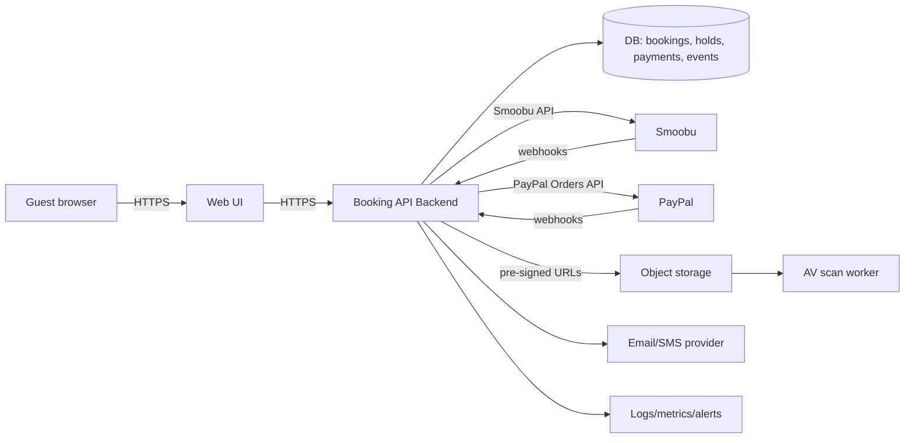
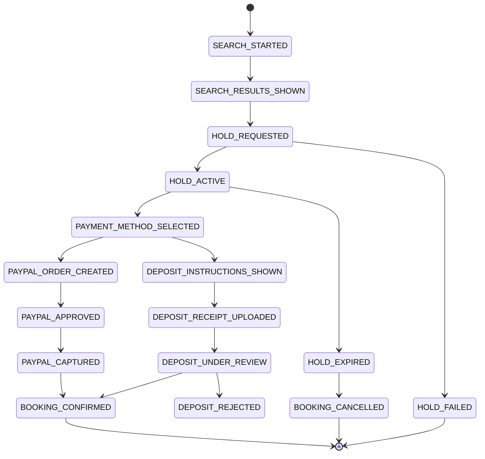
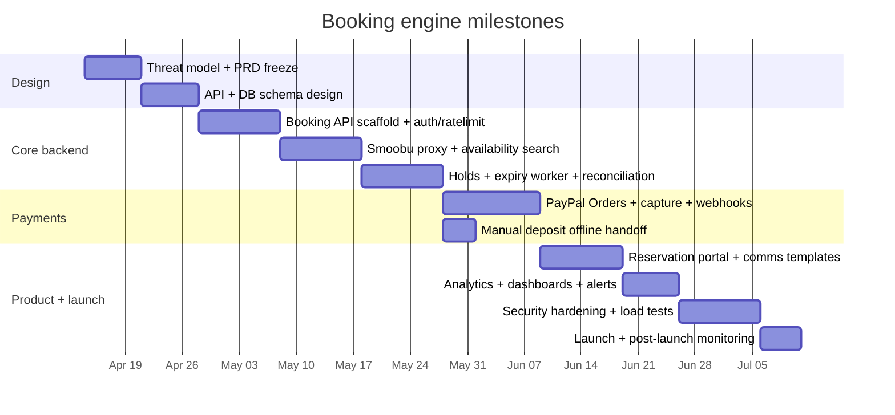

# Secure, production-grade booking engine with Smoobu API, PayPal, and offline manual deposit handoff

## Executive summary

Building a secure, production-grade booking engine on top of the Smoobu API with **automatic PayPal booking** and an **offline manual deposit handoff** is feasible, but only if you introduce a **backend-only booking API**, a **database-backed state machine**, and **webhook-driven reconciliation** (Smoobu + PayPal). Smoobu explicitly notes that, for security, its API should not be called from a front-end; you should place a backend proxy in between. citeturn25view2

The major security risks to manage are (a) **calendar/availability abuse** (bots “reserving all slots”), (b) **race conditions / double bookings** between “availability shown” and “booking created,” and (c) **payment confirmation integrity** (ensuring what you mark “paid” corresponds to a verified PayPal capture). OWASP explicitly calls out “making a reservation” as a sensitive business flow that attackers can automate to deny service to legitimate users. citeturn23view0

A **recommended blueprint** is:

- **Search/availability**: server calls Smoobu’s `POST /booking/checkApartmentAvailability` each time the guest searches, and again immediately before holds/booking creation, using the same arrival/departure and guest count. citeturn25view0  
- **Hold/booking**: for PayPal checkout, create a *real, expiring hold* in your DB and a *real, expiring hold* in Smoobu using Smoobu’s “Blocked channel” (id `11`) or “Direct booking” (id `13`) depending on how you want it to appear in Smoobu. citeturn17search0turn16search0turn25view0  
- **PayPal**: create order → redirect/approve → capture → confirm booking, with **webhook signature verification** and strict **idempotency** (PayPal-Request-Id + internal idempotency keys). citeturn13search0turn13search3turn22search0turn22search5  
- **Deposit**: no custom deposit approval or admin panel in MVP. Show offline contact/payment instructions only; staff handle any accepted deposit booking directly in Smoobu or existing business channels.

### What I had to learn to answer well

- How Smoobu supports **availability checks, booking create/update/cancel**, and **webhooks**, including constraints like CORS and rate limits. citeturn25view0turn25view2turn25view1turn16search0  
- How PayPal supports **order creation/capture**, **idempotency**, and **webhook authenticity verification**. citeturn13search0turn13search3turn22search0turn22search1  
- How your current codebase (TommasoRibaudo/kalawala-web) already handles Smoobu iFrame embedding, cookie consent, analytics, and webhooks. fileciteturn37file0L1-L1 fileciteturn38file0L1-L1 fileciteturn44file0L1-L1  
- Best practices for **secrets management**, **encryption**, **session/timeouts**, and **rate limiting**. citeturn15search8turn15search0turn8search2turn15search4  
- Analytics event-spec alignment with GA4 “recommended events” (purchase/begin_checkout/add_payment_info), and consistent event properties across tools. citeturn24search0turn24search2  

## Current repo baseline and what it implies

Your current repository (kalawala-web) is a React (CRA) site with:

- A Smoobu embed component that dynamically loads `BookingToolIframe.js`, initializes the Smoobu widget, and tracks step changes via `postMessage` parsing. fileciteturn37file0L1-L1  
- A PostHog initialization that defaults to opt-out capturing, then opts in based on stored analytics consent. fileciteturn43file0L1-L1  
- A cookie consent service stored in localStorage with expiry/versioning and cookie cleanup. fileciteturn39file0L1-L1  
- A GA4 “Smoobu tracking” service that appends UTM parameters to the Smoobu iframe URL and fires custom GA4 events for widget view/interaction. fileciteturn40file0L1-L1  
- A Meta Pixel service with robust script loading/retry logic and consent gating. fileciteturn41file0L1-L1  
- A PHP webhook endpoint (`public/smoobu-webhook.php`) that validates a shared secret passed via query string and forwards events into PostHog. fileciteturn38file0L1-L1  
- A deployment pipeline to a hosting environment using an FTPS GitHub Action, plus secret scanning (gitleaks), dependency audit, and TypeScript type-checking gates. fileciteturn44file0L1-L1  

**What this means for your “proper booking engine” plan:**

- You are currently embedding Smoobu’s booking engine via iFrame (a supported method). citeturn14search12turn9search2turn9search3  
- That iFrame approach reduces backend complexity, but it **cannot** satisfy a custom PayPal booking workflow with your own state machine, because you need server-side holds, verified payment state, and unforgeable booking state.  
- You already have the beginnings of a webhook mindset (Smoobu → PHP endpoint), but the current webhook handler is analytics-forwarding, not **booking-authoritative**. A production booking engine needs webhook ingestion into a DB with idempotency, replay protection, and reconciliation jobs.

## Recommended target architecture and state machine

### Why backend-only proxy is non-negotiable

Smoobu states that “due to security concerns” their API cannot be called directly from a front-end app and recommends building a backend proxy in any server language (PHP/Node/Python). citeturn25view2  
This aligns with your stated priority: keeping calendars non-targetable and preventing exposed keys.

### Architecture overview



### AWS infrastructure (Terraform-managed)

Backend runs on AWS: API Gateway + Lambda, RDS PostgreSQL, ElastiCache Redis, S3, Secrets Manager, SES, CloudWatch, WAF/CloudFront — all provisioned via Terraform IaC. See [plan.md — AWS infrastructure](plan.md#aws-infrastructure-terraform-managed) for the full service table, Terraform file structure (`infra/`), and key decisions (Lambda vs Fargate, state backend, secrets rotation).

Key points:

- **All Smoobu calls and keys stay server-side**, never in the browser. citeturn25view2  
- **DB is the source of truth for “your booking state machine,”** while Smoobu is the source of truth for external calendar sync and confirmed/cancelled reservations.
- **Webhooks** are required for correctness. Smoobu explicitly says cron-based polling cannot guarantee real-time correctness and recommends webhook notifications when calendar/rates/availability change. citeturn16search0  
- Implement rate-limits and anti-automation controls because reservation endpoints are sensitive business flows. citeturn23view0turn15search4  

### DB state machine (core)

A safe model is to treat every guest attempt as a **booking session** that transitions states only via server-validated events (user actions, webhook events, and system actions).



**Crucial design rule:** Only your backend can move a session into `BOOKING_CONFIRMED`; the browser cannot “assert success.”

### Availability truthfulness and double-booking avoidance

Smoobu’s availability endpoint returns not only available apartments but also pricing and “reasons for disapproval” (restrictions), which is exactly what you need to avoid showing “available” when it is not actually bookable. citeturn25view0

To make “availability shown = availability real”:

- Always run availability checks server-side with **arrival/departure + guests** right before:
  - displaying results,
  - creating a hold,
  - creating a booking/reservation. citeturn25view0  
- Introduce a **short-lived server-side cache** for repeated checks (e.g., 10–30 seconds keyed by `(arrival, departure, guests)`), but never rely on cache for final booking writes.
- Subscribe to Smoobu webhooks and reconcile changes. Webhooks exist specifically because cron/polling isn’t real-time reliable. citeturn16search0  
- Respect Smoobu rate limits (1000 requests/min) and use response headers to implement a backoff strategy. citeturn25view1  

### Listing redirect behavior (search results → listing page in new tab)

Result cards link to the existing listing page in a new tab (`target="_blank"`, `rel="noopener noreferrer"`). URL: `/{slug}` (EN) or `/{slug}ES` (ES) using the `houseLangCode`/`slug` field. See [plan.md — Listing redirect behavior](plan.md#listing-redirect-behavior-available-results--listing-page-in-new-tab) for URL patterns, the `AvailableProperty` interface, and result card UI requirements.

### Language handling across the booking engine

Fully bilingual EN/ES. Use string maps (`bookingStrings`) rather than component duplication. Persist `language` (`'en' | 'es'`) in `booking_session` for server-side comms. Integrate `LanguageSwitcher` on booking routes (`/book` ↔ `/bookES`). See [plan.md — Language handling](plan.md#language-handling-across-the-booking-engine) for the full string map and route conventions.

### Styling standards for the booking engine

Use Kalawala design tokens (`$kalawala-darker-green`, `$kalawala-dark-green`, `$kalawala-light-green`, `$kalawala-text-gray`, `Urbanist` font), React Bootstrap grid, co-located `.style.scss` files, BEM-like class naming, and responsive breakpoints at 992px/1199px. See [plan.md — Styling standards](plan.md#styling-standards-for-the-booking-engine-ui) for the full reference including accessible card markup patterns.

### Listing-page calendar with per-night price dots

Listing pages display colored dots per date (green/yellow/red/grey) relative to the month average price. Backend endpoint `GET /api/calendar/:apartmentSlug?month=YYYY-MM` proxies Smoobu `GET /api/rates`, computes avg/min/max stats, and caches per (apartmentId, month) with 5–10 min TTL. Frontend component `CalendarWithPriceDots` fetches on mount and on month navigation. See [plan.md — Calendar pricing dots](plan.md#listing-page-calendar-with-per-night-price-dots) for dot classification thresholds, lazy-loading strategy, component structure, SCSS, and analytics events.

## Payment and booking flows

### Manual deposit handoff design

Earlier drafts described an automated deposit workflow:

- Collect user info
- Block the house
- Show a page with a 1-hour timer + deposit instructions
- Guest uploads a deposit picture
- If guest has problems they can contact you (timer is currently “fake”)

This automated workflow is now out of MVP because it requires a custom admin panel and approval/review operations. MVP manual deposit is an offline handoff only.

Smoobu gives you two building blocks you can use for deposit-based holds:

- A dedicated **Blocked channel** (`channelId = 11`) (and related “blocked channel auto”), which is a natural fit for temporary holds. citeturn17search0  
- A **cancel reservation endpoint** (`DELETE /api/reservations/<reservationId>`) which keeps the cancellation in the system as “cancelled booking.” citeturn16search0  

#### MVP decision

- Do not create an automated Smoobu hold for manual deposit in MVP.
- Do not upload receipt files in the custom booking engine.
- Do not build a deposit review queue, approve/reject workflow, or hold-extension workflow.
- Show localized instructions and contact links only.
- Clearly state that manual deposit is not confirmed by the custom engine.
- Staff handle any accepted manual deposit booking directly in Smoobu or existing business channels.

PayPal remains the only automatic confirmation path in the custom engine.

#### Manual deposit handoff flow

1. **Guest selects arrival/departure/guests** in UI.
2. Backend calls `POST /booking/checkApartmentAvailability` and returns:
   - list of available properties,
   - pricing (if any),
   - restriction messages. citeturn25view0  
3. Guest selects “manual deposit/contact” instead of PayPal.
4. UI shows localized contact and payment instructions.
5. UI states clearly that the booking is not confirmed by the custom engine.
6. Optional: frontend/backend records `manual_deposit_handoff_clicked` for funnel analytics.

### PayPal flow with webhook verification and idempotency

#### Core PayPal sequence

- Use PayPal Orders API (v2) to create an order and then capture after buyer approval. citeturn13search0turn13search9  
- Use **PayPal-Request-Id** on REST `POST` calls that support it, to enforce idempotency and prevent duplicate captures/orders on retries. citeturn13search3turn13search0  
- Subscribe to webhook events relevant to Orders (e.g., approval/completion) and treat webhooks as the final authority. citeturn13search10turn22search5  

#### Webhook verification (required)

PayPal provides:

- a `POST /v1/notifications/verify-webhook-signature` endpoint for postback verification, where you send:
  - transmission_id/time, cert_url, auth_algo, transmission_sig, webhook_id, and the full event payload. citeturn22search0turn22search2  
- a “self verification” method (offline verification) and stresses that without verification you can’t validate sender authenticity. citeturn22search1turn22search3  

#### Idempotency and replay protection pattern

**Rules:**

- Every booking_session gets:
  - `idempotency_key` (UUID)
  - `paypal_order_id` (once created)
  - `paypal_capture_id` (once captured)
- Every webhook event is stored with:
  - `paypal_event_id` (unique) and a unique constraint to drop duplicates.
- All state transitions are “compare-and-swap” in DB (single transaction).

**Pseudo-implementation (TypeScript style) for PayPal webhook verification (postback method):**

```ts
async function handlePayPalWebhook(req, res) {
  const rawBody = req.rawBody; // must be raw for signature checks
  const headers = req.headers;

  // 1) Verify PayPal authenticity (postback verification)
  const verification = await paypalVerifyWebhookSignature({
    auth_algo: headers['paypal-auth-algo'],
    cert_url: headers['paypal-cert-url'],
    transmission_id: headers['paypal-transmission-id'],
    transmission_sig: headers['paypal-transmission-sig'],
    transmission_time: headers['paypal-transmission-time'],
    webhook_id: process.env.PAYPAL_WEBHOOK_ID,
    webhook_event: JSON.parse(rawBody),
  });

  if (verification.verification_status !== 'SUCCESS') {
    // return 400 so PayPal retries; also alert security
    return res.status(400).send('invalid signature');
  }

  // 2) Idempotency: store event_id; if already processed, return 200 fast
  const event = JSON.parse(rawBody);
  if (await alreadyProcessed(event.id)) return res.status(200).send('ok');

  // 3) Apply state machine transitions with DB transaction + concurrency controls
  await applyPayPalEventToBooking(event);

  // 4) Always return 2xx for successfully received+verified events
  return res.status(200).send('ok');
}
```

This aligns with PayPal’s documentation that webhooks should be verified and listeners should be idempotent and handle retries gracefully. citeturn22search5turn22search1  

#### PayPal flow recommendation in your context

Use the **same hold strategy as deposit**:

1. Availability recheck (server) citeturn25view0  
2. Create hold (DB + Smoobu) citeturn17search0turn16search0  
3. Create PayPal order with PayPal-Request-Id citeturn13search0turn13search3  
4. Redirect/approve  
5. Capture order with PayPal-Request-Id citeturn13search0turn13search3  
6. Confirm booking: update Smoobu booking fields; send confirmation email/SMS. citeturn16search0  

## Security, privacy, monitoring, and operational handoff

### Security checklist for your specific threat model

#### API keys, secrets, and config

- Smoobu requires API keys for authenticated calls. citeturn21view0  
- Use a secrets manager or at least strict secret handling practices (no hard-coding, least privilege, rotation plans). OWASP’s Secrets Management guidance emphasizes encryption and controlled handling of secrets. citeturn15search8  
- Your pipeline already runs secret scanning (gitleaks) and injects secrets at build/deploy time. Keep this, but ensure **backend secrets** (Smoobu, PayPal client secrets, webhook IDs) never reach the browser bundle. fileciteturn44file0L1-L1  

#### Encryption and sensitive data minimization

- Minimize stored PII: store only what you need to operate booking + compliance. OWASP’s Cryptographic Storage guidance emphasizes “minimize storage of sensitive information” and use authenticated encryption modes. citeturn15search0  
- Encrypt highly sensitive fields at rest (e.g., passport-like data if ever collected; deposit references if sensitive) using AES-GCM and maintain key management processes. citeturn15search0turn15search1  

#### Rate limits, bot defense, and “reservation endpoints”

- Smoobu rate limits are 1000 requests/min, with rate limit headers and `429` errors when exceeded. Build backoff and caching. citeturn25view1  
- OWASP highlights “making a reservation” as a workflow attackers can automate to lock inventory. To mitigate:
  - rate-limit hold and booking endpoints,
  - add CAPTCHA/human detection on suspicious patterns,
  - device fingerprinting / anomaly detection,
  - IP reputation filtering (careful with false positives). citeturn23view0  
- OWASP also recommends rate limiting and maximum payload sizes to prevent resource exhaustion. citeturn15search4  

#### Webhook security and replay protection

- PayPal: verify signatures (mandatory). citeturn22search3turn22search0  
- Smoobu webhooks: the API docs emphasize webhooks for real-time updates but do not describe a signature scheme; you should use:
  - a random secret token (as you already do in your `smoobu-webhook.php`),  
  - IP allowlists only if Smoobu provides stable IPs (often not reliable),  
  - strict JSON parsing,  
  - idempotency and dedupe on `(action, booking id, modified-at)` if present. fileciteturn38file0L1-L1 citeturn16search0  

### File upload security for deposit receipts

Custom deposit receipt upload is out of MVP. If this feature is added later, treat uploads as adversarial:

- Use **pre-signed URLs** to object storage so your app servers don’t stream raw files and don’t expose permanent credentials. (Example best practice is documented for object storage providers like S3.) citeturn8search11  
- Enforce:
  - allowlisted MIME types (e.g., `image/jpeg`, `image/png`, maybe `application/pdf`),
  - file size limits,
  - file extension checks (as a weak signal only),
  - store outside web root,
  - virus scanning (async) before review. OWASP’s File Upload Cheat Sheet explicitly recommends validating size/type and treating uploaded files as untrusted. citeturn8search7  
- Never trust client-provided `Content-Type`; inspect magic bytes server-side after upload. citeturn8search7  

### Session/timer behavior

Your current “fake timer” is understandable as a UX nudge, but it undermines your security goal (“when a booking is done that it actually does happen”) because inventory could remain held indefinitely.

Recommended for PayPal holds:

- Implement a real `expires_at` on the server.
- Run a scheduled job (every minute) to expire holds and cancel Smoobu reservations.
- Do not implement custom admin extensions in MVP.
- If a guest needs manual help, route them to existing contact channels; staff handles exceptions outside the custom app.

Session/security guidance aligns with enforcing server-side timeouts; standards like NIST discuss both overall and inactivity timeouts for authenticated sessions, reinforcing the idea that session expiration is a real control, not a UI-only feature. citeturn26search0  

### “Reservation portal access via reservation ID + password”

You asked for a success page with reservation details and a portal accessible via reservation ID + user-generated password.

Recommendations:

- Allow the guest to set a password (or PIN) at booking time; store **only a salted hash** (Argon2/bcrypt/scrypt).
- Apply NIST-style guidance: avoid overly strict complexity rules that backfire; prioritize length and rate limiting. NIST explicitly frames session timeouts and rate limiting as key mitigations for online guessing. citeturn26search0turn26search2  
- Rate-limit login attempts per reservation ID and per IP/device; lock and require email verification after repeated failures. citeturn26search2turn15search4  
- Consider an alternative or supplement: “magic link” emailed to the guest (reduces password handling), but you can still keep password to match your requirement.

### Monitoring, alerting, logging

- Log security-relevant events: failed webhook verifications, repeated hold attempts, rate-limit triggers, booking state inconsistencies.
- OWASP logging guidance: do not log secrets, tokens, passwords, session IDs; mask sensitive values; implement tamper detection and controlled access to logs. citeturn15search3  

### No custom admin panel in MVP

MVP does not include a custom admin dashboard, deposit receipt queue, approve/reject buttons, or hold-extension controls.

- Manual deposit is an offline handoff; staff handle accepted deposit bookings directly in Smoobu or existing business tools.
- If PayPal webhook indicates reversal/uncaptured state, put booking into “needs attention” and notify staff. citeturn13search10turn22search5  

### Edge cases and recovery playbook

- **Availability race**: property becomes unavailable after search but before hold creation → backend returns “no longer available” and re-renders results. (Always re-check availability just-in-time.) citeturn25view0  
- **PayPal captured, Smoobu create fails**: mark booking as “payment captured / provisioning failed” → retry reservation creation with idempotency; if still failing, alert staff and show guest “We received payment; booking confirmation pending.” PayPal idempotency is designed for safe retries. citeturn13search3  
- **Webhook duplicates/out-of-order**: store webhook events and process idempotently; don’t assume ordering. PayPal retries delivery for days if non-2xx responses. citeturn22search1turn22search3  
- **Manual deposit handoff confusion**: guest thinks offline deposit is confirmed by the custom engine → copy must clearly state that manual deposit is not confirmed until staff confirms outside the engine.
- **Bot attacks on reserve endpoints**: enforce rate limits, CAPTCHA, anomaly detection. citeturn23view0turn15search4  

## PRD, implementation plan, and task checklist

### Product requirements document

**Goal**: Guests can search any future date range and either (a) book with PayPal (automatic confirmation after verified payment) or (b) choose manual deposit handoff (offline contact only), while ensuring your inventory/availability is correct, secrets are protected, and the booking state is tamper-resistant.

**Non-goals (recommended to keep scope sane initially)**:
- Full channel-manager UI (leave to Smoobu)
- Dynamic pricing rules engine (use Smoobu rates unless needed)
- Automated manual-deposit approval or receipt upload workflow

**Core features**
- Availability search (arrival, departure, guests)  
- Results page that can show “0 houses available” (not an error)  
- Property selection + checkout
- Payment method selection: PayPal or manual deposit handoff
- PayPal: order create/approve/capture, confirm booking
- Deposit: offline contact/payment instructions only; no custom confirmation
- Reservation portal: reservation ID + password login, view reservation details, request changes/cancel (policy-based)
- Webhooks: PayPal + Smoobu ingestion (verified, idempotent)
- Analytics: consistent events across PostHog + GA4 + Meta Pixel with consent

**Non-functional requirements**
- Security: backend-only keys, verified webhooks, rate limits
- Reliability: idempotency, retries, reconciliation jobs
- Observability: logs/metrics, alerting on mismatches
- Performance: cache short-lived availability results; respect Smoobu rate limits. citeturn25view1  

### API endpoints (proposed)

(Representative; adjust to your stack.)

- `POST /api/search`
  - input: arrival_date, departure_date, guests
  - output: properties[] + message + “no availability” structured response
- `GET /api/calendar/:apartmentSlug?month=YYYY-MM`
  - returns per-day price, availability, min stay, and month stats (avg/min/max) for listing-page calendar price dots
  - backend proxies Smoobu `GET /api/rates`, caches per (apartmentId, month) with 5–10 min TTL
- `POST /api/holds`
  - creates hold in DB and (recommended) Smoobu hold
- `POST /api/paypal/order`
  - creates PayPal order (stores order_id)
- `POST /api/paypal/capture`
  - captures approved order (idempotent)
- `GET /api/deposit-handoff` or static localized content
  - returns manual deposit/contact instructions; does not confirm a booking
- `POST /api/webhooks/paypal`
  - verifies signature; idempotent apply
- `POST /api/webhooks/smoobu`
  - validates secret; idempotent apply
- `POST /api/portal/login`
  - reservation_id + password → session token
- `GET /api/portal/reservation/:id`
  - returns reservation details (authorized)

### Data models (minimum viable)

- `booking_session`
  - id, created_at, expires_at, status, arrival/departure, guests
  - chosen_property_id (nullable)
  - payment_method (paypal|deposit)
  - language (`'en'` | `'es'` — detected at session start, used for all UI text and server-side communications)
  - reservation_portal_password_hash (optional)
- `property` (maps internal data to Smoobu)
  - id, smoobu_apartment_id, slug (the `houseLangCode` value, e.g., `"Geco"`, `"Rana"` — used to build language-aware listing page URLs: `/{slug}` for EN, `/{slug}ES` for ES)
  - name, guest_capacity, thumbnail_url, amenities
- `hold`
  - id, booking_session_id, property_id
  - status (active|expired|cancelled|converted)
  - smoobu_reservation_id (nullable)
- `payment`
  - booking_session_id
  - method (paypal)
  - paypal_order_id, paypal_capture_id, status
- `webhook_event`
  - provider (paypal|smoobu)
  - external_event_id, received_at, processed_at, status, payload_hash
- `audit_log`
  - actor (system/provider/guest), action, object_type, object_id, before/after

### Test cases (high priority)

- Availability returns “no houses available” with valid inputs (any future date range). citeturn25view0  
- Concurrency: two guests attempt same property/date:
  - only one hold succeeds; the other receives “no longer available”
- PayPal retry safety:
  - repeated `create order` with same internal idempotency key returns same PayPal order_id (or a clean error)
  - repeated capture with same PayPal-Request-Id does not double-capture citeturn13search3turn13search0  
- PayPal webhook verification:
  - invalid signature rejected, no state changes citeturn22search0turn22search3  
- Manual deposit handoff:
  - selecting handoff does not create a confirmed booking or purchase event.
- Hold expiration:
  - expires and cancels Smoobu reservation automatically citeturn16search0  
- Smoobu API rate limiting:
  - backoff behavior when `429` or low remaining quota appears citeturn25view1  

### Analytics event mapping

Your repo already captures Smoobu iFrame behavior to PostHog (`smoobu_step_changed`, `smoobu_booking_started`, etc.) and gates analytics by consent. fileciteturn37file0L1-L1  
For the new booking engine, use a unified analytics schema so you can reason consistently across tools.

**GA4 recommended events**: Use `begin_checkout`, `add_payment_info`, and `purchase` where applicable; Google documents parameters and emphasizes using prescribed parameters. citeturn24search0turn24search2

| Funnel step | PostHog event | GA4 event | Meta Pixel event | Trigger | Core properties |
|---|---|---|---|---|---|
| Search submitted | `booking_search` | `search` (or custom) | `Search` | guest clicks “Search” | arrival, departure, guests |
| Results shown | `availability_results` | custom | — | results render | available_count, min_price |
| Property viewed | `property_viewed` | `view_item`/custom | `ViewContent` | property page opened | property_id, price |
| Checkout started | `checkout_started` | `begin_checkout` | `InitiateCheckout` | user clicks “Book” | value, currency, dates citeturn24search0turn24search2 |
| Payment method selected | `payment_method_selected` | `add_payment_info` | `AddPaymentInfo` | user selects PayPal or manual deposit handoff | payment_type, value, currency citeturn24search0turn24search2 |
| PayPal approved | `paypal_approved` | custom | — | return from PayPal approval | paypal_order_id |
| Booking confirmed | `booking_confirmed` | `purchase` | `Purchase` | server marks confirmed | transaction_id/res_id, value, currency citeturn24search3turn24search2 |
| Manual deposit handoff clicked | `manual_deposit_handoff_clicked` | custom | `Lead` (optional) | guest clicks offline deposit/contact handoff | contact_method |

**Sample payloads (illustrative):**

PostHog:
```js
posthog.capture('booking_confirmed', {
  reservation_id: 'R12345',
  property_id: 'P10',
  arrival: '2026-06-01',
  departure: '2026-06-05',
  value: 550,
  currency: 'USD',
  payment_method: 'paypal',
})
```

GA4:
```js
gtag('event', 'purchase', {
  transaction_id: 'R12345',
  value: 550,
  currency: 'USD',
  items: [{ item_id: 'P10', item_name: 'Casa X', quantity: 1, price: 550 }],
})
```
(Parameters and the `items` array are documented by Google’s GA4 references. citeturn24search3turn24search0)

Meta Pixel:
```js
fbq('track', 'Purchase', { value: 550, currency: 'USD' })
```

### Milestones timeline



### Open questions (unspecified items)

- Exact cancellation/refund policies (PayPal refunds, deposit handling) and deadlines.
- Whether provisional holds should be created as “Blocked” (`11`) or “Direct booking” (`13`) in Smoobu for reporting/accounting purposes. citeturn17search0  
- Whether you need multi-property bookings (one reservation blocking multiple apartments) and how you want to expose that in UI.
- Whether you want to send guest communications via Smoobu messaging endpoints or via your own email/SMS provider. (Smoobu supports reservation messaging endpoints.) citeturn16search0  
- ~~Which hosting/runtime you will use for the backend~~ → **Decided: AWS infrastructure provisioned via Terraform** (see infrastructure section below).

### Prioritized recommendations and next steps

1. Build the backend booking API first (no UI polish) and prove correctness: availability → hold → confirm/cancel. Base this on Smoobu’s CORS guidance and availability endpoint. citeturn25view2turn25view0  
2. Implement Option A holds in Smoobu with real expiry and anti-bot defenses (rate limits + CAPTCHA triggers), because reservation endpoints are a known sensitive business flow target. citeturn23view0turn15search4  
3. Add PayPal with strict webhook verification and idempotency; treat webhooks as authoritative. citeturn22search0turn13search3turn22search5  
4. Add manual deposit as an offline handoff only; do not build a custom upload/review/admin workflow in MVP.  
5. Only after the above is stable: implement the reservation portal and analytics event mapping.

## Detailed task list

### Milestone planning checklist (with estimated effort)

[x] 1.1 Threat model workshop: document attacker goals (inventory lock, scraping, payment spoofing), trust boundaries, and required mitigations (rate limits, webhook verification, upload hardening). (6h)  
[x] 1.2 PRD freeze: finalize flows (PayPal, offline deposit handoff, portal), non-functional requirements, operational handoff, and success metrics. (6h)  
[x] 1.3 Data model design: define DB tables, indexes, unique constraints for idempotency (hold uniqueness, webhook dedupe). See `docs/own_booking_engine/data_model.md`. (8h)  
[x] 1.4 API contract design: specify request/response schemas for search/hold/PayPal/deposit-handoff/portal endpoints. See `docs/own_booking_engine/api_contract.md`. (8h)  

[x] 2.1 Backend scaffold: create Booking API service (framework, routing, validation, public endpoint hardening). (10h)  
[x] 2.2 Rate limiting + abuse controls: implement per-IP/per-device limits; add CAPTCHA challenge triggers for “hold/create” endpoints. (10h)  
[x] 2.3 Secrets management: configure secure storage for Smoobu/PayPal credentials, webhook secrets, encryption keys. (6h)
[x] 2.4 Observability baseline: structured logs, correlation IDs, error alerts, dashboards. (8h)  

[x] 2.5 Terraform project scaffold: create `infra/` directory with `main.tf` (AWS provider, S3+DynamoDB remote state backend), `variables.tf`, `outputs.tf`, and environment-specific `.tfvars` files (dev/staging/prod). (6h)  
[x] 2.6 Terraform VPC + networking: define VPC, public/private subnets, NAT gateway, security groups for Lambda/RDS/ElastiCache. (8h)  
[x] 2.7 Terraform RDS PostgreSQL: provision RDS instance in private subnet with encryption at rest, automated backups, Secrets Manager integration for credentials. (8h)  
[x] 2.8 Terraform Lambda + API Gateway: define Lambda functions for booking API endpoints, API Gateway REST API (v1) with routes, CORS config, and WAF rate-limiting rules. REST API chosen over HTTP API (v2) because REST API supports direct WAF WebACL association. (12h)  
[x] 2.9 Terraform S3 + CloudFront: CloudFront distribution for frontend if needed; do not provision custom deposit-receipt upload storage in MVP. (6h)  
[x] 2.10 Terraform supporting services: ElastiCache Redis for rates/availability cache, SES for transactional email, CloudWatch log groups + alarms. (8h)  
[x] 2.11 Terraform CI/CD integration: add `terraform plan` to PR checks and `terraform apply` to deployment pipeline (GitHub Actions). (6h)  

[x] 3.1 Smoobu proxy client: implement server-side client with retries/backoff and rate-limit header handling. (10h)  
[x] 3.2 Availability search endpoint: implement `POST /api/search` using Smoobu availability check; return structured “no houses available” response. (10h)  
[x] 3.3 Property catalog: build a safe mapping from public property slugs → Smoobu apartment IDs; include `slug` field (matching `houseLangCode` from `src/utils/constants.ts`) for language-aware listing page URLs; prevent enumeration. (8h)  
[x] 3.4 Search UI integration: implement date picker (future dates allowed), guest count, results list + "none available" message. (10h)  
[x] 3.5 Listing redirect from results: each available property card in search results must link to the existing listing page in a new tab (`target="_blank"`, `rel="noopener noreferrer"`); URL built as `/{slug}` (EN) or `/{slug}ES` (ES) based on detected language. Follow `HomeCard` / `OtherListings` visual pattern. (8h)  
[x] 3.6 Booking engine i18n: implement bilingual string maps (EN/ES) for all booking UI text (search, results, checkout, deposit, confirmation, errors); persist `language` in `booking_session` for server-side communications; integrate `LanguageSwitcher` on booking routes (`/book` ↔ `/bookES`). (12h)
[x] 3.7 Booking engine styling: apply existing website design tokens (`$kalawala-darker-green`, `$kalawala-dark-green`, `$kalawala-light-green`, `$kalawala-text-gray`, `Urbanist` font) and patterns (React Bootstrap grid, co-located `.style.scss`, BEM-like class naming, responsive breakpoints at 992px/1199px, accessible card markup). (8h)  
[x] 3.8 Calendar pricing backend: implement `GET /api/calendar/:apartmentSlug?month=YYYY-MM` endpoint that proxies Smoobu `GET /api/rates` for the apartment's full month, computes avg/min/max stats from available dates, and returns per-day price/availability/minStay + stats. Cache per (apartmentId, month) with 5–10 min TTL; invalidate on Smoobu `updateRates` webhook. (12h)  
[ ] 3.9 Calendar price dots frontend: implement `CalendarWithPriceDots` component for listing pages; fetch month data on mount and on month navigation; render colored dots (green/yellow/red/grey) per date based on month average; lazy-load new months on navigation; accessible `aria-label` per dot in current language. (14h)  
[ ] 3.10 Calendar dot styling: implement `.price-dot` SCSS with color variants (green #4CAF50, yellow #FFC107, red #F44336, grey #BDBDBD); test at mobile breakpoints; ensure dots are visible without cluttering the calendar grid. (4h)  

[ ] 4.1 PayPal hold creation: implement DB hold + Smoobu provisional hold creation for PayPal checkout (choose blocked vs direct booking channel). (12h)  
[ ] 4.2 Hold expiry worker: schedule job to expire PayPal holds and cancel Smoobu reservations. (10h)  
[ ] 4.3 Manual deposit handoff page: show localized bank/contact instructions and state clearly that manual deposit is not confirmed by the custom engine. (6h)  
[ ] 4.4 Manual deposit handoff analytics/notification: track handoff clicks and optionally notify staff through existing email/WhatsApp process; no custom receipt upload. (6h)  
[x] 4.5 Removed from MVP: custom admin review UI, approve/reject queue, receipt upload review, and hold-extension controls. (0h)  

[ ] 5.1 PayPal Orders integration: create order + capture endpoints; store PayPal-Request-Id and internal idempotency keys. (14h)  
[ ] 5.2 PayPal webhooks endpoint: implement signature verification (postback or self verification), dedupe, and state transitions. (14h)  
[ ] 5.3 Payment reconciliation job: periodic check of “pending PayPal” sessions; resolve missing webhooks; alert anomalies. (10h)  

[ ] 6.1 Smoobu webhooks ingestion: implement secure webhook endpoint with secret validation, dedupe, and reconciliation with DB. (12h)  
[ ] 6.2 Guest communication templates: implement email/SMS templates for each state (hold created, payment pending, confirmed, cancelled, manual deposit handoff). (8h)  
[ ] 6.3 Reservation portal auth: reservation ID + password creation, hashing, rate limiting, session management. (14h)  
[ ] 6.4 Portal pages: reservation details, payment status, request cancellation/help. (14h)  

[ ] 7.1 Analytics schema: define events + properties; implement PostHog + GA4 + Meta Pixel triggers with consent gating. (10h)  
[ ] 7.2 Security hardening pass: secrets review, logging redaction, webhook replay protection, dependency audit gates. (10h)  
[ ] 7.3 Load + abuse testing: simulate bot traffic on search/hold endpoints; validate rate limits and cost controls. (12h)  
[ ] 7.4 Launch readiness: runbooks, alerts, on-call plan, rollback plan, post-launch monitoring checklist. (10h)

## CI/CD: frontend vs backend deployment separation

The existing GitHub Actions workflow (`.github/workflows/main.yml`) deploys **only the React frontend** to cPanel via FTPS. It runs `npm run build` and uploads the `build/` folder. Backend code (`infra/`, Lambda handlers, etc.) does not end up in `build/`, so it won't accidentally land on the frontend server — but there is currently **no pipeline to deploy the backend or infrastructure**.

### Current workflow (frontend only)

```
main.yml: push to main → secret-scan → audit → typecheck → npm run build → FTP upload build/ to cPanel
```

This remains unchanged for the frontend.

### Required: backend deployment workflow

A separate workflow (or separate jobs in the same file) is needed for:

1. **Terraform plan/apply** — provisions AWS infrastructure (VPC, RDS, Lambda, API Gateway, S3, ElastiCache, etc.)
2. **Lambda code deploy** — packages backend code and deploys to Lambda (either via Terraform `aws_lambda_function` with `filename` or via `aws lambda update-function-code`)

### Recommended workflow structure

```yaml
# .github/workflows/deploy-backend.yml
name: Deploy Backend

on:
  push:
    branches: [main]
    paths:
      - 'infra/**'
      - 'backend/**'

jobs:
  terraform-plan:
    # Runs on every push, posts plan as PR comment if on a PR
    ...

  terraform-apply:
    # Runs only on main after plan succeeds
    needs: [terraform-plan]
    ...

  deploy-lambda:
    # Packages backend code, uploads to S3, updates Lambda function
    needs: [terraform-apply]
    ...
```

Key points:
- **Path filtering**: only triggers when `infra/` or `backend/` files change, so frontend-only pushes don't re-deploy infra.
- **AWS credentials**: use OIDC federation (recommended) or store `AWS_ACCESS_KEY_ID` / `AWS_SECRET_ACCESS_KEY` in GitHub Secrets.
- **Terraform state**: remote backend (S3 + DynamoDB) — the workflow runs `terraform init` then `plan`/`apply` with the appropriate `.tfvars`.
- **Environment protection**: use GitHub Environments with required reviewers for prod applies.

### Task checklist

[ ] 8.1 Create `deploy-backend.yml` workflow: Terraform init/plan/apply for `infra/` with path filtering, AWS OIDC auth, and environment-specific `.tfvars` selection. (8h)  
[ ] 8.2 Lambda packaging step: build and zip backend code, upload artifact to S3, update Lambda function code (either via Terraform or AWS CLI). (6h)  
[ ] 8.3 Environment protection rules: configure GitHub Environments (dev/staging/prod) with required reviewers for prod Terraform applies. (4h)  
[ ] 8.4 Verify deployment isolation: confirm that frontend deploys (main.yml) never touch backend resources, and backend deploys (deploy-backend.yml) never touch cPanel. Add path filters and smoke tests. (4h)  
